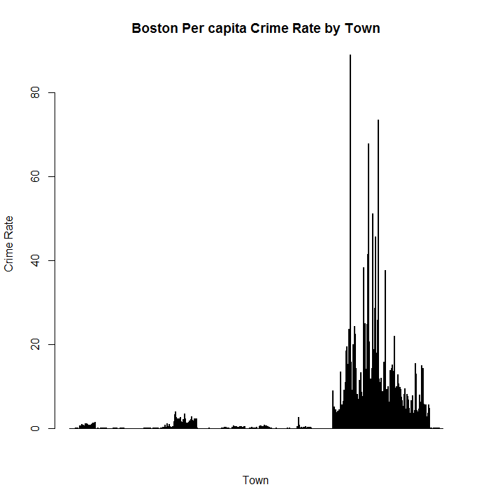
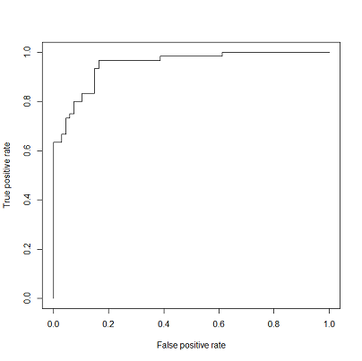
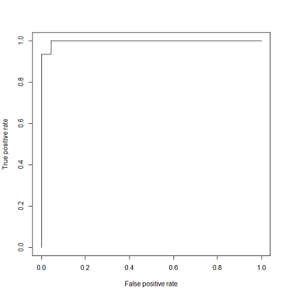
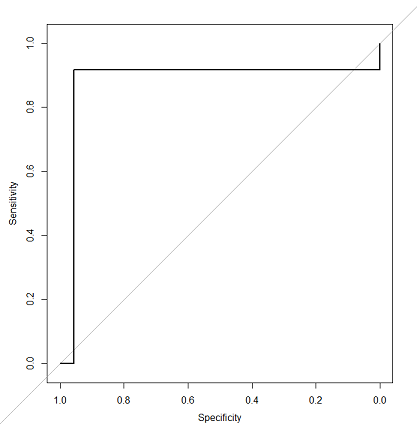
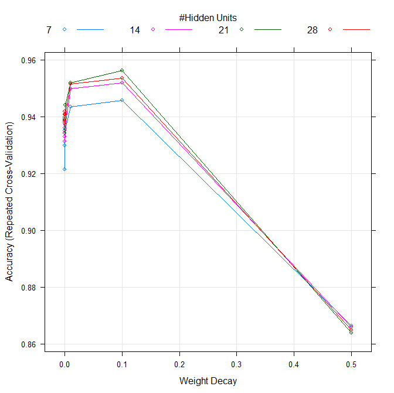
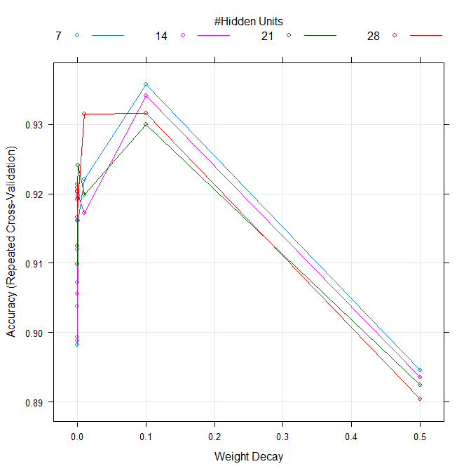
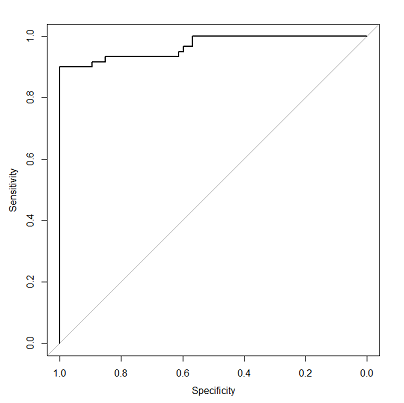
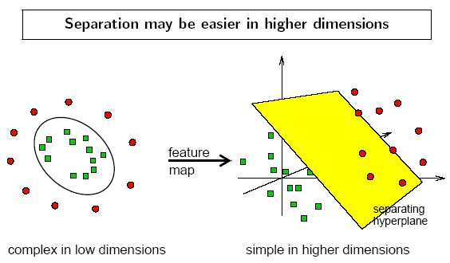
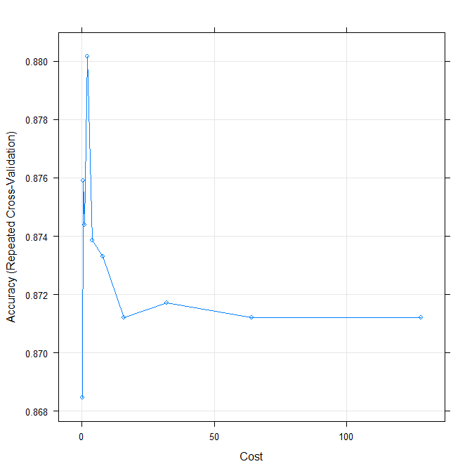
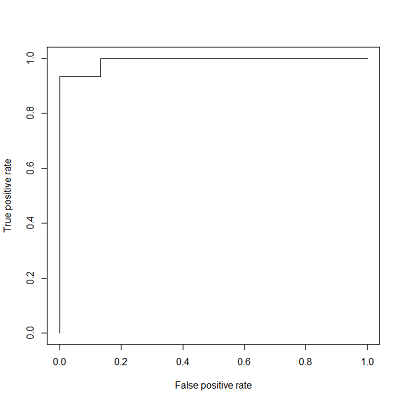

# Table of Contents

* [Table of Contents](#table-of-contents)
* [Introduction](#introduction)
  * [Accuracy](#accuracy)
  * [Kappa](#kappa)
  * [Area Under the Curve (AUC)](#area-under-the-curve-auc)
  * [Let's go!](#lets-go)
* [Implementation](#implementation)
  * [Problem Setup](#problem-setup)
  * [Data Exploration](#data-exploration)
  * [Add The Response Varable](#add-the-response-varable)
  * [Create The Training And Test Sets](#create-the-training-and-test-sets)
  * [Model Fitting - Logistic Regression](#model-fitting---logistic-regression)
  * [Model Fitting - KNN](#model-fitting---knn)
  * [Model Fitting - Random Forest](#model-fitting---random-forest)
  * [Baseline Model Summary](#baseline-model-summary)
  * [Model Fitting - Neural Network](#model-fitting---neural-network)
  * [Model Fitting - Support Vector Machine](#model-fitting---support-vector-machine)
	 * [SVM with linear kernel](#svm-with-linear-kernel)
	 * [SVM with polynomial kernel](#svm-with-polynomial-kernel)
	 * [SVM with radial basis function (RBF) kernel](#svm-with-radial-basis-function-rbf-kernel)
* [Final Summary](#final-summary)

# Introduction

For this write-up I'd like to explore the Boston data set.  Specifically I’d like to setup a binary classification problem where we attempt to predict if a town has high crime or not (classified as “Yes” or “No”) utilizing R as our programming language.

The methodology will be first to examine some “simpler” models, and see what kind of accuracy, kappa, and area of the curve (AUC) metrics we can generate with them.  We’ll then pick the best “simple” model and label it as our baseline for comparisons. 

Next, we’ll consider two more complicated models, Neural Networks and Support Vector Machines, and see if those can give us better performance than the baseline.

In order to compare the performance of the various models we'll consider three metrics for each:  accuracy, kappa, and area under the curve (AUC).

## Accuracy


Image credit:  www.mmtpl.com


In order to assess accuracy we first train a model on a known set of data.  After the model is trained a number of observations the model hasn’t seen are fed through, and the classification assignments for the unseen records output by the model are recorded.  The model’s classification assignments are then compared against the actual classification assignments, and a percentage of correct classifications is computed.

So after training a model and giving it some new data we might see output similar to this:

```R
result 	No  Yes
No      52  5
Yes     15  55
```

The rows in the table above are the actual classifications, and the columns are what the model predicted based on its training.  The table can be rewritten like this:

|result 		   |Predicted: No|Predicted: Yes|Total|
|------------------|-------------|--------------|-----|
|Actual: No  	   |52   		 |5				|57	  |
|Actual: Yes 	   |15  		 |55			|70	  |
|Total			   |67			 |60            |	  |

```
Total correct classification: 52 + 55 = 107
Total observations: 127
```

So in this example the model incorrectly classified five observations as “Yes” when in fact they should have been classified as “No.”   Likewise it incorrectly classified fifteen “Yes” observations as “No.”

And to calculate the accuracy we can add up the number of correct classifications and then divide them by the total observations:
```(52+55)/(52+55+15+5) = .8425```

We can now say that this model has an 84.25% accuracy rating based on the predictions it made against a previously unseen set of data (usually called the “test” data set).

If you want to learn more [this](http://www.dataschool.io/simple-guide-to-confusion-matrix-terminology/) is a great overview.

## Kappa

I think the best way to explain kappa is to start with an example([1](https://stats.stackexchange.com/questions/124001/what-is-the-intuition-behind-the-kappa-statistical-value-in-classification)):

```R
# Example 1:  A balanced dataset
tab[1,1] <- 45
tab[1,2] <- 5
tab[2,1] <- 5
tab[2,2] <- 45

   pred
act  A    B
A    45   5
B    5    45

Accuracy : 0.9            
Kappa : 0.8            
```

```R
# Example 2: An unbalanced datasest
tab[1,1] <- 85
tab[1,2] <- 5
tab[2,1] <- 5
tab[2,2] <- 5

   pred
act  A    B
A    85   5
B    5    5

Accuracy : 0.9                                        
Kappa : 0.444            
```

First, notice both examples give the same accuracy rating:  90%.  However, what if what we really cared about was the “B” label, and we were using it to make a cancer diagnosis or identify fraudulent activity?  In that case “Example 2: An unbalanced dataset” would be returning the wrong classification **50% of the time** for the variable we were most concerned with!  Even though Example 2 had a high accuracy rating, that statistic is being skewed by the unbalanced data set and hence the kappa value of 0.444.
  
Clearly using Example 2 would be a disaster; imagine telling someone they had cancer and only having a 50% chance of actually being correct....

So we can use the kappa statistic to control for unbalanced data sets and keep a high accuracy rate from masking an underlying flaw in the model.

And to steal a few explanations from outside sources:

> The way it [kappa] is usually described is the amount of agreement correct by the agreement expected by chance. 
> However, it technically isn't corrected by chance but instead reports if the agreement is greater than by chance. 
> Although the Kappa statistic is widely used, I believe it is most generally applied to predictive models built 
> from unbalanced data (i.e. class distributions not equivalent).
([2]( https://stats.stackexchange.com/questions/124001/what-is-the-intuition-behind-the-kappa-statistical-value-in-classification))

>The Kappa statistic (or value) is a metric that compares an Observed Accuracy with an Expected Accuracy (random 
> chance). The kappa statistic is used not only to evaluate a single classifier, but also to evaluate classifiers
> amongst themselves. In addition, it takes into account random chance (agreement with a random classifier), which
> generally means it is less misleading than simply using accuracy as a metric (an Observed Accuracy of 80% is a
> lot less impressive with an Expected Accuracy of 75% versus an Expected Accuracy of 50%).
([3]( https://stats.stackexchange.com/questions/82162/cohens-kappa-in-plain-english))

So let’s review the example we used in the Accuracy section above and calculate the kappa value for it:

|result 		   |Predicted: No|Predicted: Yes|Total|
|------------------|-------------|--------------|-----|
|Actual: No  	   |52   		 |5				|57	  |
|Actual: Yes 	   |15  		 |55			|70	  |
|Total			   |67			 |60            |	  |

```
Total correct classification: 52 + 55 = 107
Total observations: 127
```

```
Kappa = (observed accuracy - expected accuracy)/(1 - expected accuracy)
Ground truth: No (57), Yes (70) 
Machine Learning Classifier: No (67), Yes (60) 
Total: (127) 
Observed Accuracy: ((52 + 55) / 127) = 0.84
Expected Accuracy: ((57 * 67 /127) + (70 * 60 / 127)) /127 = 0.50
Kappa: (0.84 - 0.50) / (1 - 0.50) = 0.68
```

So the kappa for this model is 0.68, and the accuracy we arrived at earlier was 84.25%.  Now that we see a kappa value of 0.68 the 84.25% accuracy figure frankly isn’t as impressive, and it would be even less so for smaller kappa values.


## Area Under the Curve (AUC)

When dealing with classification problems typically the chances that a particular observation is classified one way or another is given as a probability.  So in the case of a binary classification problem we might have one observation with only a 0.22 probability of being “Yes,” while perhaps a second observation has a great “Yes” probability of 0.74.

In order to decide where the cutoff is between “Yes” or “No” a `threshold` is specified.  This is simply a value that divides the assignment of an observation into one class or another.  So for example we might set a threshold of 0.5.  This means any observation with a probability of 0.5 or greater will be assigned “Yes,” and an observation with a probability of less than 0.5 will be assigned “No.”  

As we alter the threshold value the classification error rates of the model will change.  So for example a threshold of 0.9 will make it more difficult for an observation to be labeled as “Yes,” and so the number of correct classifications for “Yes” will increase.  However now some observations that might have been assigned to “Yes” will be classified as “No,” and so the number of incorrect classifications for “No” will also increase.  If we lower the threshold then the inverse holds true:  Incorrect classifications for “Yes” will increase; incorrect classifications for “No” will decrease.

Typically the chosen threshold value will be determined by domain knowledge of the problem.  Perhaps in the case of cancer diagnosis the threshold should be high; the impact of telling someone they have cancer if you’re not almost 100% certain is simply too great.  On the other hand perhaps if we’re testing aircraft engines for defects we’d rather be overly cautious and set the threshold low.  It’s OK if some engines are flagged as problematic and sent back through testing again vs. having them malfunction midflight.

One tool to visualize the tradeoffs for various threshold values is the `ROC curve`.  It graphs the true positive rate against the false positive rate for all possible thresholds.  Here is an example of what an ROC curve looks like:


Image credit:  i.stack.imgur.com

When examining an ROC curve the more the line hugs the top left corner of the graph the better.  We can then measure the area under the curve (AUC), and obtain a numeric metric for the threshold vs. error rate performance.  The maximum value the AUC can ever have is one, so the closer to one the AUC score is the better.  

So given two models we’d prefer the one with a larger AUC metric, as it will give us more correct results overall irrespective of the threshold value selected.  It would also be nice to know the model will function consistently over a range of thresholds vs. having a spike in the graph for certain threshold values.  The latter case would likely indicate some problem with the model that would warrant further investigation.

You can read more about the AUC [here](http://fastml.com/what-you-wanted-to-know-about-auc/) and [here](https://en.wikipedia.org/wiki/Receiver_operating_characteristic).


## Let's go!

So, now that we've covered all that, let’s get started!

# Implementation 

(Note:  You can find the full script for this write-up [here](./fullScript.R).)

## Problem Setup

```R
# Allow those following along to achieve the same results when running the code...
set.seed(10)

# Remove all objects except for functions in the environment
rm(list = setdiff(ls(), lsf.str()))

# Load up our data set
library(MASS)
attach(Boston)
```

## Data Exploration

```R
# Columns in the data
names(Boston)

# Number of rows
nrow(Boston)

# How many missing values do we have
sapply(Boston,function(x) sum(is.na(x)))

# If we wanted a graphical representation of the missing values:
library(Amelia)
missmap(Boston, main = "Missing Values vs. Observed")

# How many unique values do we have for each column
sapply(Boston, function(x) length(unique(x)))

# Summary of the overall data set
summary(Boston)

# Record the "crim" median for use later on
crimMeadian = 0.25651
```

Something interesting happens when we take a look at our response variable, "crim", in the summary:  We note that the third quartile is set at 3.68 but the max value reported for "crim" is 88.98.  There is a huge jump in values in the fourth quartile (3.68 to 88.98).  This certainly doesn't indicate a Gaussian distribution, and instead indicates a dataset with values skewed to the left (i.e. negative skew).  Graphing the Boston$crim variable confirms this:

```R
barplot(Boston$crim, main="Boston Per capita Crime Rate by Town", xlab="Town", ylab="Crime Rate")
```



Later on we are going to want to convert the "crim" variable into a binary categorical value where suburbs fall into a "No" or "Yes" rating for high crime.  When we do this we should avoid using the mean and instead utilize the median value in our model.  This will mitigate the skewed nature of the data set in the conversion.  Otherwise we'll end up incorrectly labeling various suburbs as "Yes" for crime instead of "No."


## Add The Response Variable

```R
# Create a variable to hold categorical assignments; set initial values to "No"  
Boston$crimRating = "No"

# Assign "Yes" to anything greater than the crim median
# Reminder:  We are using median due to the left skewed nature of the "crim" variable
Boston$crimRating[Boston$crim > median(Boston$crim)] = "Yes"

# The function "factor" is used to encode a vector as a factor; do this to utilize "crimRating" as a categorical variable
Boston$crimRating = factor(Boston$crimRating)

# Confirm the addition
is.factor(Boston$crimRating)
contrasts(Boston$crimRating)

# Visually inspect the results and drop the "crim" column
table(Boston$crimRating)
Boston = Boston[-drop(1)]

# And finally, what percentage of our data points are categorized as "No"
sum(Boston$crimRating=="No") / nrow(Boston) * 100
#[1] 50
```

The previous lines tells us that by simply choosing "No" as the categorical prediction value for each test set element we'd achieve a 50% success rate!  So any model we develop must at the very, very least have a 50% accuracy rate, or we'd be better off simply randomly guessing "No" each time.

## Create The Training And Test Sets

```R
# We'll utilize 75% of the samples for the training set
trainIndex = sample(nrow(Boston), floor(nrow(Boston)*.75))
train = Boston[trainIndex,]
test = Boston[-trainIndex,]

# Confirm data set assignments (should equal zero)
nrow(train) + nrow(test) - nrow(Boston)
```

## Model Fitting - Logistic Regression

```R
# Create a logistic regression model
model = glm(crimRating~., data=train, family=binomial)
summary(model)

# Cacluate the accuracy rating of the model
pre = predict(model, test, type="response")
result = rep("No", length(pre))
result[pre > crimMeadian] = "Yes"
table(result, test$crimRating)
mean(result==test$crimRating) * 100

# result No Yes
# No  52   5
# Yes 15  55
# [1] 84.25197
```

So this model provides an accuracy rate of 84.3%, which is certainly much better than a 50% success rate using random guessing.

And what if we simplify the model by only utilizing those variables with a small z value as given by the "summary" command?

```R
model = glm(crimRating ~ +zn +nox +dis +rad +tax +ptratio +medv, data=train, family=binomial)
summary(model)
pre = predict(model, test, type="response")
result = rep("No", length(pre))
result[pre > crimMeadian] = "Yes"
table(result, test$crimRating)
mean(result==test$crimRating) * 100

# result No Yes
# No  55   2
# Yes 12  58
#[1] 88.97638
```

We'll also calculate the kappa value:

```R
Kappa = (observed accuracy - expected accuracy)/(1 - expected accuracy)
Ground truth: No (57), Yes (70) 
Machine Learning Classifier: No (67), Yes (60) 
Total: (127) 
Observed Accuracy: ((55 + 58) / 127) = 0.89
Expected Accuracy: ((57 * 67 /127) + (70 * 60 / 127)) /127 = 0.50
Kappa: (0.89 - 0.50) / (1 - 0.50) = 0.78

```

Thus we have both simplified the model and improved it up to an 89% accuracy rate against the test data set.

Just as a sanity check let's assess our two models utilizing k-Fold Cross-Validation where k = 10:

```R
library(boot)
model = glm(crimRating~., data=train, family=binomial)
1 - cv.glm(train, model, K=10)$delta[1]
#[1] 0.9243247

model = glm(crimRating ~ +zn +nox +dis +rad +tax +ptratio +medv, data=train, family=binomial)
1 - cv.glm(train, model, K=10)$delta[1]
#[1] 0.9254507
```

There is only a 0.001 difference between the two...  We'll continue to utilize the 2nd model since it is simpler and outputs a higher accuracy rating on the test data

The ROC curve and AUC also look solid:

```R
library(ROCR)
pred = prediction(pre, test$crimRating)
prf = performance(pred, measure = "tpr", x.measure = "fpr")
plot(prf)

auc = performance(pred, measure = "auc")
auc = auc@y.values[[1]]
auc
# [1] 0.9507463
```



Let's explore two other models, and then we can settle on our "baseline" to compare against the more advanced implementations.


## Model Fitting - KNN

```R
# Load the "knn" library
library(class)

# Assign the train and test data to variables we can pass to the knn function as parameters
kTrain = cbind(train$zn, train$nox, train$dis, train$rad, train$tax, train$ptratio, train$medv)
kTest = cbind(test$zn, test$nox, test$dis, test$rad, test$tax, test$ptratio, test$medv)
kTrain.crimRating = train$crimRating

# Run model with k=1
k = 1
knnPre = knn(kTrain, kTest, kTrain.crimRating, k)
mean(knnPre==test$crimRating) * 100
#[1] 94.5

# Run model with k=3
k = 3; knnPre = knn(kTrain, kTest, kTrain.crimRating, k); mean(knnPre==test$crimRating) * 100
#[1] 93.7

# Run model with k=5
k = 5; knnPre = knn(kTrain, kTest, kTrain.crimRating, k); mean(knnPre==test$crimRating) * 100
# [1] 92.9
```

It appears that k=1 is our best bet, but let's confirm with cross-validation.  (Note:  We'll start utilizing the caret package to make this easier on ourselves...)

```R
library(caret)

# Tell caret we want to examine k values from 1 to 15
tuneControl = expand.grid(.k=1:15)

# Setup the k-Fold Cross-Validation where k = 10 and we repeat the process 5 times
fitControl = trainControl(method = "repeatedcv", number = 10, repeats = 5)

# Let caret find the best model
knnFit = train(crimRating ~ +zn +nox +dis +rad +tax +ptratio +medv, data = train,
               method = "knn", 
               trControl = fitControl,
               tuneGrid = tuneControl, 
               preProcess = c("center","scale")
)

# Examine the results
knnFit
# Accuracy was used to select the optimal model using the largest value.
# The final value used for the model was k = 1.

plot(knnFit)

confusionMatrix(predict(knnFit, test[,-14]), test$crimRating)

# Reference 
# Prediction No Yes
# No  64   5
# Yes  3  55
# Accuracy : 0.937
# Kappa : 0.8734
```


And finally we'll take a look at the ROC and AUC for the KNN model wher K = 1 with and without k-Fold Cross-Validation:

```R
# Without k-Fold Cross-Validation:
k = 1
knnPre = knn(kTrain, kTest, kTrain.crimRating, k)
pre = prediction(c(knnPre), test$crimRating)
perf = performance(pre, measure = "tpr", x.measure = "fpr")
plot(perf, type="S")

auc = performance(pre, measure = "auc")
auc = auc@y.values[[1]]
auc
# [1] 0.9600496
```



So that looks pretty good; now for the same model with k-Fold Cross-Validation:

```R
# (Note:  The caret package uses the "pROC" package for ROC/AUC calculations, so we need to do some conversion
# to make everything work with ROCR package we used earlier...)

# Use the KNN model created with caret to make predictions of the test set
vals = predict(knnFit, test[,-14])
# Convert the caret prediction set into a ROCR prediction object
pre2 = prediction(c(vals), test$crimRating)
# Now we can proceed as before using ROCR
perf2 = performance(pre2, measure = "tpr", x.measure = "fpr")
plot(perf2, type="S")

auc2 = performance(pre2, measure = "auc")
auc2@y.values[[1]]
# [1] 0.944665
```


So there is a small drop in the AUC value, and that is to be expected since we're utilizing k-Fold Cross-Validation which mitigates to some degree the overfitting (similiar to how accuracy drops when moving from the training to the testing data set).

And, as a bonus for anyone worried that converting from caret/pROC to ROCR might contain logic errors:

```R
# Double-check our work above utilizing caret and the pROC library
pre3 = predict(knnFit, test[,-14], type='prob')
auc3 = roc(ifelse(test[,14]=="Yes",1,0), pre3[[2]])
plot(auc3, type="S")

auc3
# Area under the curve: 0.9447
```



So everything checks out, and we are good to go.  We can now move on to our next model...

## Model Fitting - Random Forest

```R
library( randomForest)
rForest = randomForest(crimRating~., data=train, importance=TRUE)
varImpPlot(rForest)
pre = predict(rForest, test, type="response")
table(pre, test$crimRating)
mean(pre==test$crimRating) * 100
#[1] 93.70079

rForest = randomForest(crimRating ~ +zn +nox +dis +rad +tax +ptratio +medv, data=train, importance=TRUE, mtry=4)
varImpPlot(rForest)
pre = predict(rForest, test, type="response")
table(pre, test$crimRating)
mean(pre==test$crimRating) * 100
#[1] 93.70079
```
And again let's confirm utilizing k-Fold Cross-Validation where k = 10 and we repeat the process 5 times:

```R
rForest = train(y=train$crimRating, x=train[,-14], trControl = fitControl, preProcess = c("center","scale"))
rForest
# The final value used for the model was mtry = 13.

confusionMatrix(test$crimRating, predict(rForest, test[,-14]))
# Reference
# Prediction No Yes
# No  62   5
# Yes  4  56
# Accuracy : 0.9291
# Kappa : 0.858

rForestData = train[,c("zn", "nox", "dis", "rad", "tax", "ptratio", "medv")]
rForest = train(y=train$crimRating, x=rForestData, trControl = fitControl, preProcess = c("center","scale"))
rForest
# The final value used for the model was mtry = 4.

confusionMatrix(test$crimRating, predict(rForest, test[,-14]))
# Reference
# Prediction No Yes
# No  63   4
# Yes  4  56
# Accuracy : 0.937
# Kappa : 0.8736

plot(rForest)
```


So the best model we found utilizing Random Forest only utilized statistically significant explanatory variables, and it was tuned with the mtry parameter set to 4.

```R
# Calculate the ROC and AUC to compare against the other models:
pre = predict(rForest, test[,-14], type='prob')
auc = roc(ifelse(test[,14]=="Yes",1,0), pre[[2]])
plot(auc, type="S")

auc
# Area under the curve: 0.9447
```


## Baseline Model Summary


Holy cow, we are finally done and can move on to the neural network!  Here is a summary of results from the models we just developed and assessed:

|Model                |Accuracy Rate  |Kappa |AUC   | 
|---------------------|---------------|------|------|
|Logistic Regression  |92.5%		  |0.78	 |0.9507|	
|K-Nearest Neighbors  |93.7%		  |0.87  |0.9447|
|**Random Forests     |93.7%		  |0.87  |0.9447|

So, from these results we'll go w/ the "Random Forests" model as our baseline to compare more advanced models against.  The Random Forests model was kneck-in-kneck with the K-Nearest Neighbors model, so we'll let the .0002 difference in Kappa value sway our final decision.

## Model Fitting - Neural Network

First let's define the settings we want caret to use when training the neural network model (NNM)

```R
# Setup the k-Fold Cross-Validation where k = 10 and we repeat the process 5 times
fitControl = trainControl(method = "repeatedcv", number = 10, repeats = 5)

# Set the tune parameters for the caret NNM
tuneControl = expand.grid(
  size = seq(from = 7, to = 28, by = 7), 
  decay = c(0.5, 0.1, 1e-2, 1e-3, 1e-4, 1e-5, 1e-6, 1e-7)
)
```

`Size` is the number of units in the hidden layer; we'll go with 1,2,3, and 4 times the number of features.  

`Decay` is the regularization parameter to avoid over-fitting, and we'll examine a number of values for this tuning parameter as well.

```R
# Now let caret find the best model utilizing the tuning parameters
nnm = train(crimRating ~ +zn +nox +dis +rad +tax +ptratio +medv, data = train, 
            method = "nnet", 
            trControl = fitControl,
            tuneGrid = tuneControl, 
            preProcess = c("center","scale")
)
```

Note:  When utilizing a NNM we always want to center and scale the features to avoid the algorithm failing to converge before the number of maximum iterations allowed is met

```R
# Examine the results
nnm
# Accuracy was used to select the optimal model using  the largest value.
# The final values used for the model were size = 21 and decay = 0.01.

confusionMatrix(predict(nnm, test[,-14]), test$crimRating)
# Reference
# Prediction No Yes
# No  62   4
# Yes  5  56
# Accuracy : 0.9291
# Kappa : 0.858

plot(nnm)
```


The value 0.9291 is interesting, because it is the exact same value we received when we trained the KNN model with only statistically significant explanatory variables and the Random Forest model with all explanatory variables.

So let's try training the model again with all explanatory variables included:

```R
nnm = train(crimRating ~., data = train,
            method = "nnet",
            trControl = fitControl,
            tuneGrid = tuneControl,
            preProcess = c("center","scale")
)


# Examine the results
nnm
# Accuracy was used to select the optimal model using the largest value.
# The final values used for the model were size = 7 and decay = 0.1.

confusionMatrix(predict(nnm, test[,-14]), test$crimRating)
# Accuracy : 0.9134
# Kappa : 0.8264

plot(nnm)
```



So a little less accurate utilizing all the explanatory variables of the Boston data set

And finally, what if we let caret utilize random values for the size and decay?

*NOTE*:  Fair warning, the command below can take a while to complete....  And by "awhile" I mean like "I had time to go eat lunch and take a nap while it was working" kind of a while....

```R
nnm = train(crimRating ~., data = train,
            method = "nnet",
            trControl = fitControl,
            tuneLength = 20,
            preProcess = c("center","scale")
)

# Examine the results
nnm
# Accuracy was used to select the optimal model using  the largest value.
# The final values used for the model were size = 9 and decay = 0.1.

confusionMatrix(predict(nnm, test[,-14]), test$crimRating)
# Accuracy : 0.9055
```

So it appears that in addition to taking forever to compute letting caret utilize random values for tuning resulted in a model that fits less well than our previous two neural networks.

Let's go with the first NNM we tested, and take a look at the ROC and AUC values:

```R
nnm = train(crimRating ~ +zn +nox +dis +rad +tax +ptratio +medv, data = train, 
            method = "nnet", 
            trControl = fitControl,
            tuneGrid = tuneControl, 
            preProcess = c("center","scale")
)

pre = predict(nnm, test[,-14], type='prob')
auc = roc(ifelse(test[,14]=="Yes",1,0), pre[[2]])
plot(auc)

auc
# Area under the curve: 0.9721
```



We'll record the neural network results for later, and move on to the next model, the Support Vector Machine (SVM).

## Model Fitting - Support Vector Machine

SVMs are reputed to be excellent models for binary classification problems.  The SVM attempts to find a "hyperplane" that successfull separates classes in n-space (i.e. the number of features), and then optimizes the hyperplane in such a way that it falls between the classes with a maximum distance between the classes and the hyperplane (i.e. the "margin").


Image credit:  www.safaribooksonline.com

Additionally, SVMs can support complicated and/or non-linear classifications by utilizing a "kernel."  The kernel maps the SVM's inputs into a high-dimensional feature spaces where solving the problems becomes much easier.  

(Imagine for example crossing a line without touching it in 2D space.  Once you move upwards into 3D space the problem becomes trivial: You simply move upwards in the Z dimension, and then pass over the line.  In effect your have "crossed" the line, but you never touched it...)


Image credit:  dtreg.com

So, having said all that, in theory a SVM should give us a good fit for our goal of predicting the classification of the crime rate for towns in Boston (i.e. a binary classification problem).  We'll try it out with three kernels:  a linear kernel, a polynomial kernel, and a radial basis function (RBF) kernel and see what we get!


### SVM with linear kernel

Setup the k-Fold Cross-Validation where k = 10 and we repeat the process 5 times:  

```R
# Note we need to add the parameter "classProbs=TRUE", so that we can utilize pROC with this model later on
fitControl = trainControl(method = "repeatedcv", number = 10, repeats = 5, classProbs=TRUE)

# Configure and train the SVM model
# NOTE: We are reducing the tuneLength parameter to 10, as tuneLength = 20 was taking a very, very long time to complete
svm = train(crimRating ~ +zn +nox +dis +rad +tax +ptratio +medv, data = train, 
            method = "svmLinear2",    #utilizes the "e1071" library 
            trControl = fitControl,
            tuneLength = 10, 
            preProcess = c("center","scale")
)

# Examine the results
svm
# Accuracy was used to select the optimal model using  the largest value.
# The final value used for the model was cost = 2.

confusionMatrix(predict(svm, test[,-14]), test$crimRating)
# Reference
# Prediction No Yes
# No  64  15
# Yes  3  45
# Accuracy : 0.8583
# Kappa : 0.7127


plot(svm)
```



So the accuracy for the SVM model with a linear kernel is rather poor compared to previous models.  However, this does make sense, as one could imagine it's hard for the poor model to draw a straight line between seven different features. 

And looking at the model's ROC graph and AUC value:

```R
pre = predict(svm, test[,-14], type='prob')
auc = roc(ifelse(test[,14]=="Yes",1,0), pre[[2]])
plot(auc)

auc
# Area under the curve: 0.9453
```


### SVM with polynomial kernel

Setup the k-Fold Cross-Validation where k = 10 and we repeat the process 5 times:

```R
fitControl = trainControl(method = "repeatedcv", number = 10, repeats = 5)

# Configure and train the SVM model
# NOTE:  We are setting the "tuneLength" parameter to 5, because 10+ is bogging down the author's poor laptop....   :(
svm = train(crimRating ~ +zn +nox +dis +rad +tax +ptratio +medv, data = train, 
            method = "svmPoly",
            trControl = fitControl,
            tuneLength = 5, 
            preProcess = c("center","scale")
)


# Examine the results
svm
# Accuracy was used to select the optimal model using  the largest value.
# The final values used for the model were degree = 3, scale = 1 and C = 1.

confusionMatrix(predict(svm, test[,-14]), test$crimRating)
# Reference
# Prediction No Yes
# No  58   4
# Yes  9  56
# Accuracy : 0.8976 
# Kappa : 0.7955

plot(svm)
```


We have some improvement, but still less accuracy that previous models have produced.  Although the hyperplane created by the polynomial is more flexible than the linear model, it still isn't flexible enough to model our feature set with high accuracy.

And looking at the model's ROC graph and AUC value:

```R
vals = predict(svm, test[,-14])
pre = prediction(c(vals), test$crimRating)
perf = performance(pre, measure = "tpr", x.measure = "fpr")
auc = performance(pre, measure = "auc")
auc@y.values[[1]]
# [1] 0.8995025

plot(perf, type="S")
```



### SVM with radial basis function (RBF) kernel

Setup the k-Fold Cross-Validation where k = 10 and we repeat the process 5 times:

```R
fitControl = trainControl(method = "repeatedcv", number = 10, repeats = 5)

# Configure and train the SVM model
svm = train(crimRating ~ +zn +nox +dis +rad +tax +ptratio +medv, data = train, 
            method = "svmRadial",
            trControl = fitControl,
            tuneLength = 20, 
            preProcess = c("center","scale")
)

# Examine the results
svm
# Tuning parameter 'sigma' was held constant at a value of 0.2945036
# Accuracy was used to select the optimal model using  the largest value.
# The final values used for the model were sigma = 0.2945036 and C = 2.

confusionMatrix(predict(svm, test[,-14]), test$crimRating)
# Reference
# Prediction No Yes
# No  63   4
# Yes  4  56
# Accuracy : 0.937
# Kappa : 0.8736

plot(svm)
```


And looking at the model's ROC graph and AUC value:

```R
vals = predict(svm, test[,-14])
pre = prediction(c(vals), test$crimRating)
perf = performance(pre, measure = "tpr", x.measure = "fpr")
auc = performance(pre, measure = "auc")
auc@y.values[[1]]
# [1] 0.9368159

plot(perf, type="S")
```


So it looks like this model has the same accuracy as our baseline K-Nearest Neighbors model, 93.7%.  This is good, because we're clearly on the right track, and our models are producing consistent results.  This also bad, because we'd love to find a model that would increase the accuracy rate past 93.7%, and initially it doesn't look like the SVM will get us over the threshold.

# Final Summary

Here is a table of all the models we considered:

|Model                 |Accuracy Rate|Kappa |AUC   | 
|----------------------|-------------|------|------|
|Logistic Regression   |92.5%		 |0.78	|0.9507|	
|K-Nearest Neighbors   |93.7%		 |0.87  |0.9447|
|Random Forests        |93.7%		 |0.87  |0.9447|
|Neural Network        |92.9%		 |0.86  |0.9721|
|Support Vector Machine|93.7%		 |0.87  |0.9368|


All of them were a massive improvement over random guessing, and they had almost identical performance levels.  What is interesting is the Neural Network and Support Vector Machine models didn't have a clear improvement over our baseline model, the Random Forests.

This is likely due to the simple nature of the data set we utilized for this exercise, and it would be interesting (and hopefully illuminating) to perform the same work on a different, more complex data set.

If I had to pick a model above to move forward with I'd select the Random Forests implementation.  It executed quickly (at least when we were in charge of the tuning!), supported the ROC/AUC methods "out of the box" with no fiddling required, and non-technical persons could easily understand a graph of its decision making processes.