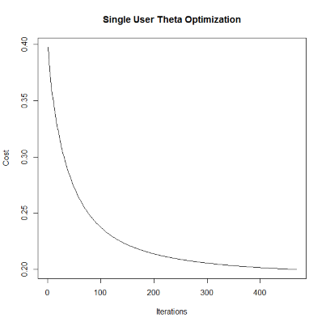
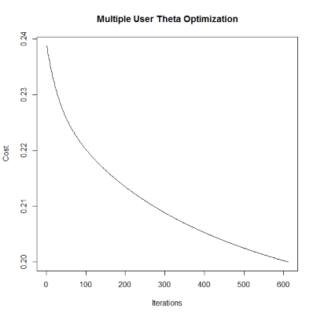
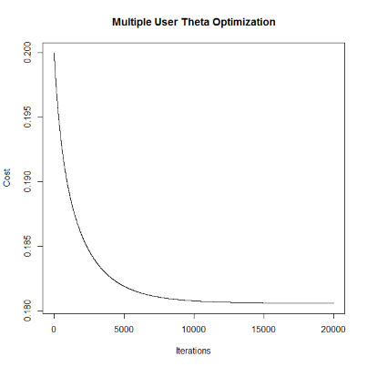

# Table of Contents

* [Table of Contents](#table-of-contents)
* [Introduction](#introduction)
* [Load and Transform the Data](#load-and-transform-the-data)
  * [Methodology](#methodology)
  * [Implementation](#implementation)
  * [Visualize the Data Matrix](#visualize-the-data-matrix)
* [Model One:  Content-based Filtering](#model-one--content-based-filtering)
  * [Step One: Calculate Optimal Theta Values Utilizing Gradient Descent](#step-one-calculate-optimal-theta-values-utilizing-gradient-descent)
	 * [Define the Cost Function](#define-the-cost-function)
	 * [Define the Gradient Descent Function](#define-the-gradient-descent-function)
	 * [Calculate Theta Values](#calculate-theta-values)
  * [Step Two: Use Optimized Theta Values to Make Predictions/Recommendations (One User)](#step-two-use-optimized-theta-values-to-make-predictionsrecommendations-one-user)
	 * [Create convenience functions...](#create-convenience-functions)
	 * [Examine User Profile](#examine-user-profile)
	 * [Test the Model Against Single Movie Selections](#test-the-model-against-single-movie-selections)
	 * [Test the Model Against All Movie Selections](#test-the-model-against-all-movie-selections)
  * [Step Three: Use Optimized Theta Values to Make Predictions/Recommendations (All Users)](#step-three-use-optimized-theta-values-to-make-predictionsrecommendations-all-users)
	 * [Calculate Theta Values](#calculate-theta-values-1)
* [Summary](#summary)

# Introduction

For this next write-up we'll explore building and using a recommendation system for movie ratings written in R.  We'll utilize the MovieLens dataset which you can find [here](https://grouplens.org/datasets/movielens/).  

(Note you can also find an annotated, full copy of the R script used in this write-up [here](./fullScript.R).)

Over the course of this write-up we'll do the following:

* Transform the MovieLens data into a usable format for a recommendation system
* Develop a recommendation system using machine learning
* Apply the recommendation system to:
  * Calculate and explore recommendations for a single user
  * Calculate and explore recommendations for a group of users

Let's get started!

# Load and Transform the Data

## Methodology

The first thing we need to do is load and transform the data into a format the recommendation model can utilize.  To do that we need to create two matrices:

* One matrix containing the features used in calculating the recommendations
  * i.e. the explanatory variables; our X values
* One matrix containing any movie ratings already given by the users that we know about
  * i.e. the response variables; our y values

For this write-up the dataset features will be the movie's genre, but obviously in a production setting we'd also likely record many other movie characteristics (actors for example) to build a robust system.  The feature matrix will be structured to contain a row for each movie, and the columns will record each genre type.  If a movie does have an associated genre type then we'll record that fact with a '1' value. 

Example:   

|Movie  |Drama|Thriller|Action|...|Sci-Fi|
|-------|-----|--------|------|---|------|
|Movie 1|1    |1       |0     |...|0     |
|Movie 2|0    |1       |0     |...|1     |
|Movie 3|0    |0       |1     |...|1     |

Movie 1 in this example is a "Drama Thriller" movie.  Movie 3 is a "Action Sci-Fi" movie.

The user ratings matrix contains a row entry for each movie, and then a column entry recording the user's rating for that movie.  The movie ratings range from one to five, and zero indicated the user hasn't rated the movie yet.  A "one" rating would imply the user didn't care for the movie, and a "five" rating would imply the user loved the movie.

Example:

|Movie  |User 1|User 2 |User 3|...|User N|
|-------|------|-------|------|---|------|
|Movie 1|5     |0      |4     |...|0     |
|Movie 2|0     |5      |5     |...|0     |
|Movie 3|3     |0      |0     |...|5     |

So in this example User 1 gave Movie 1 a five star rating and Movie 3 a three star rating.

Once we have these two matrices filled out we can make predictions.  We do that by first calculating a set of theta values for the user, and then multiplying those theta values with the feature value matrix for a given movie.  The result will be a numeric values we can utilize to predict what the user might think of a given movie.

Example:

```
User Theta = [0 5 0]
Movie Features = [1 1 0]

transpose(User Theta) * Movie Features = Recommendation Prediction

T([0 5 0]) * [1 1 0] = 5
```

So if you do the math for the theta and feature set above you'd end up with a value of five, which implies it would be a safe be to recommend the movie to the user under consideration.

If we performed the calculations above for all the movies in the dataset, ordered the results by largest prediction values, and then returned the top entries we'd have a nice "Top Movie Recommends" list we could utilize to make suggestions.

So let's actually do this in R.  :)

## Implementation

OK, there is a lot of code in the following block, but it's all to create the two matrix structures we just discussed above.  I've ensured there are comments throughout, and so it should be clear (hopefully) what's going on.
 
```R
# Clean up our environment
rm(list=ls(all=TRUE))

# Load R libraries
library(data.table)
library(stringr)
library(gplots)

# BUILD THE MOVIE FEATURE MATRIX (X) AND THE USER RATING MATRIX (y)

setwd("SOME_PATH_ON_YOUR_SYSTEM")
movies = read.csv("./data/movies.csv")

# If we've already processed the data source files then read in the processed results and save some time
if (file.exists("./genreMatrix.txt") && file.exists("./userMatrix.txt")) {
  genreMatrix = as.matrix(read.table("./genreMatrix.txt", as.is = TRUE))
  
  userMatrix = as.matrix(read.table("./userMatrix.txt", as.is = TRUE))
  colnames(userMatrix) = seq(1, dim(userMatrix)[2], 1)

# We haven't processed the data source files... Do so now
} else {
  
  ## Genre Matrix
  
  # Create a unique list of genres
  genres = unique( unlist( tstrsplit(movies$genre, '[|]') ) )
  
  # Remove "(no genres listed)" and "NA" movie entries
  genres = genres[-c(19,20)]
  
  # Create a matrix to store movie genre assignments
  genreMatrix = matrix(0, dim(movies)[1], length(genres))
  colnames(genreMatrix) = genres
  rownames(genreMatrix) = movies$movieId
  
  # Populate the matrix
  # If a movie has a given genre we note that with a '1' in the matrix
  # Loop through the movies...
  for (i in 1:nrow(genreMatrix)) {
    
    # Get the movie's pipe delimited genre assignments
    movieGenres  = movies[i,]$genres

    # Loop through the genres...
    for (j in 1:ncol(genreMatrix)) {
      genre = genres[j]  
      found = str_detect(movieGenres, genre)

      # If the  pipe delimited genre assignment string contains this genre (i.e. genres[j]) record it in the matrix
      if (found) {
        genreMatrix[i,j] = 1
      }
    }
  }
  
  fix(genreMatrix)
  
  ## User Rating Matrix
  
  # Read the source data file and filter for duplicates
  ratings = read.csv("./data/ratings.csv")
  users = unique(ratings$userId);
  
  # Create the matrix tracking the rating each user has given each movie
  userMatrix = matrix(0, dim(movies)[1], length(users))
  colnames(userMatrix) = users
  rownames(userMatrix) = movies$movieId
  
  # "Transpose" the users matrix so we have users as columns, movies as rows, and ratings as data points
  # Note:  Missing ratings for a given movie by a given user will be set to "NA"
  tmpMatrix <- dcast(ratings, movieId~userId, value.var = "rating", na.rm=FALSE)
  
  # For each movie
  for (i in 1:nrow(tmpMatrix)) {
    # For each user
    for (j in 1:(ncol(tmpMatrix)-1)) {
      # Did the user(j) rate the movie(i)?
      if (!is.na(tmpMatrix[i,j])) {
  
        # Assign the user's rating for the movie
        movieId = toString(tmpMatrix[i,]$movieId)
        # Offset to take into account tmpMatrix has the movieId column while userMatrix does not...
        offSet = j-1
        userMatrix[movieId,offSet] = tmpMatrix[i,j]
      }
    }
  }
  
  fix(userMatrix)
  
  # Write the results to file and clean up
  write.table(genreMatrix, file="genreMatrix.txt", row.names=TRUE, col.names=TRUE)
  write.table(userMatrix, file="userMatrix.txt", row.names=TRUE, col.names=TRUE)
  
  rm(genres)
  rm(users)
  rm(tmpMatrix)
}
```

## Visualize the Data Matrix

Run some general commands to review the movie genre matrix:

```R
sort(colSums(genreMatrix), decreasing = TRUE)

palette = colorRampPalette(c("white", "steelblue"))
heatmap.2(
  genreMatrix, 
  dendrogram="none", 
  trace="none", 
  key=FALSE, 
  labRow=NA, 
  scale="none", 
  col=palette, 
  main="Movie Genres"
)

# Summarize and visualize the movie genre assignments
# ToDo

#> dim(genreMatrix)
#[1] 9125   19
#> dim(userMatrix)
#[1] 9125  671
```


# Model One:  Content-based Filtering

Whew!  We now have the data in two matrices, and we can start developing the recommendation model.

## Step One: Calculate Optimal Theta Values Utilizing Gradient Descent

In order to proceed we need to create two functions:  One to execute the gradient descent algorithm, and another to calculate the cost of the theta values using MSE as we iterate through the gradient descent function:

### Define the Cost Function
```R
cost = function(X, y, theta) {
  m = length(y)
  J = sum(sum((X%*%theta - y)^2))/(2*m)
  return(J)
}
```

### Define the Gradient Descent Function
```R
calcGradientDescent = function(X, y, theta, alpha, iterations, convergence){
  m = length(y)
  J_hist = rep(0, iterations)
  
  for(i in 1:iterations){
    
    # Vectorized form for the gradient of the cost function
    theta = theta - alpha*(1/m)*(t(X)%*%(X%*%theta - y))
    
    # Record cost history for every iterative move of the gradient descent,
    J_hist[i]  <- cost(X, y, theta)
    
    # Have we converged yet?  If so we can stop iterating
    if (J_hist[i] < convergence) {
      cat("Convergence has occurred after", i, "iterations.\n")
      iterations = i
      break
    }
  }
  # Use a list to return multiple values from the function
  results<-list(theta, J_hist, iterations)
  
  # Let the user know if we didn't converge
  if (J_hist[i] >= convergence) {
    cat("Convergence did NOT occur.  Last calculated cost was: ", J_hist[i], "\n")
  }
  
  return(results)
}
```

### Calculate Theta Values

Alright, now we can work on calculating some theta values, so that we can start making predictions.  For this section let's pick one user, 8, and see what kind of theta values we compute.

```R
# genres = Features ==> X values
# Users = Responses ==> y values

# Let's initially limit ourselves to the first 100 movies with their assigned genres
x = genreMatrix[1:100,1:19] # 100x19

# Collect user 8's movie ratings
y = userMatrix[1:100,8] # 100x1

# Add bias unit
X = cbind(rep(1,dim(x)[1]), x)  # 100x20

# Create and initialize the theta matrix
theta = rep(0, dim(X)[2]) #100x1
length(theta)

# Set the gradient descent parameters
alpha = 0.1
iterations = 2000
convergence = 0.2

# Calculate user 8's theta values
results <- calcGradientDescent(X, y, theta, alpha, iterations, convergence)
theta <- results[[1]]
cost_hist <- results[[2]]
iterations = results[[3]]
```

We can visually inspect the gradient descent's optimization progress as a function of MSE (i.e. cost):

```R
plot(1:iterations, cost_hist[1:iterations], type = 'l', xlab="Iterations", ylab="Cost", main="Single User Theta Optimization")
```



Now that we have user 8's optimized theta values we can move to the next step.

## Step Two: Use Optimized Theta Values to Make Predictions/Recommendations (One User)

First we'll create some functions to make the process easier:

### Create convenience functions...

```R
# Return summary of movies a given user has rated
userRatings = function(y, movies) {
  # Determine which movies were rated by the user
  rating = y[y!=0]
  # Collect movie information for those which were rated
  movieList = movies[c(c(which(y != 0))),]
  # Combine rating and movie info
  result = cbind(rating, movieList)
  # Return results
  return(result)
}

# Return recommendation value for a single movie based on user's theta values
singleRecommendation = function(movies, genreMatrix, movieId, theta) {
  # Pull movie info
  info = movies[movies$movieId == movieId,]
  
  # Assign the movie's genre assignments to a vector (i.e. our X values) with bias unit
  m = as.matrix(genreMatrix[toString(movieId),])
  m = rbind(1,m)

  # Calculate prediction/recommendation
  prediction = t(theta)%*%m
  
  # Combine prediction and movie info
  result = cbind(prediction, info)
  
  # Return results
  return(result)
}

# Return the top X number of recommendations for a given user
topRecommendations = function(genreMatrix, theta, y, numRecommendations) {
  
  # Create X values from the user's movie ratings
  genreRowCount = dim(genreMatrix)[1]
  X = matrix(1, nrow=genreRowCount)
  X = as.matrix(cbind(X, genreMatrix))
  X = t(X)
  
  # Calculate predictions/recommendations
  pre = t(theta)%*%X
  pre = t(pre)
  pre = pre[ order(-pre[,1]), ]
  
  # Remove any movies the user has already rated
  pre = subset(pre, !(names(pre) %in% names(y[y!=0])))
  
  # Formulate and return the results
  results = subset(movies, movies$movieId %in% names(pre)[1:numRecommendations])
  return(results)
}
```

### Examine User Profile

Now that we have our helper functions completed let's explore the recommendations the model has arrived at for user 8.  We'll start by taking a look at the movies user 8 has rated, and that will give us an idea of what type of recommendations we'd expect from the recommendation model.

```R
# So what types of movies has user 8 rated?

userRatings(y, movies)
# rating movieId                                     title                  genres
# 32    5.0      32 Twelve Monkeys (a.k.a. 12 Monkeys) (1995) Mystery|Sci-Fi|Thriller
# 45    2.5      45                         To Die For (1995)   Comedy|Drama|Thriller
# 47    5.0      47               Seven (a.k.a. Se7en) (1995)        Mystery|Thriller
# 50    5.0      50                Usual Suspects, The (1995)  Crime|Mystery|Thriller
```

The summary for user 8 indicates that user 8 enjoyed movies with with Mystery and Thriller components.  Thus we'd expect our model to output recommendations containing these two genres with perhaps a smattering of Sci-Fi, Comedy, and/or Crime.

### Test the Model Against Single Movie Selections

First let's try out user 8's theta values on a move gut intuition says user 8 would *not* enjoy, and see what sort of recommendation value the model provides.  We'll use the movie "Toy Story" which isn't listed as having Mystery or Thriller genre assignments.

```R
singleRecommendation(movies, genreMatrix, 1, theta)

# prediction movieId            title                                      genres
# -0.1432672       1 Toy Story (1995) Adventure|Animation|Children|Comedy|Fantasy
```

The prediction value, -0.14, lines up with what our intuition told us:  "Toy Story" probably isn't a good recommendation for user 8 based on the low prediction value the model returned.

What if we pick one movie, but one we think user 8 *would* enjoy this time?  How about "The Tenant," which has both Mystery and Thriller genre assignments:

```R
singleRecommendation(movies, genreMatrix, 6530, theta)

# prediction movieId                              title                        genres
# 1.670882    6530 Tenant, The (Locataire, Le) (1976) Drama|Horror|Mystery|Thriller
```

And sure enough our model returns a recommendation value much greater than what we calculated for "Toy Story."  This also confirms our gut feelings that the movie "The Tenant" would be a good recommendation based on user 8's other movie ratings.

And as a sanity check let's see what the model would say about a movie we already know user 8 rated highly:

```R
singleRecommendation(movies, genreMatrix, 32, theta)

# prediction movieId                                     title                  genres
# 2.359628      32 Twelve Monkeys (a.k.a. 12 Monkeys) (1995) Mystery|Sci-Fi|Thriller
```

The model returns the highest value yet at 2.36, which is what we expected seeing has how we knew user 8 rated the movie at five out of five stars.

A quick summary of our investigations so far with user 8:

|Movie     |User Rating|Model Prediction|Grenes                                      |
|----------|-----------|----------------|--------------------------------------------|
|12 Monkeys|5          |2.36            |Mystery,Sci-Fi,Thriller                     |
|Toy Story |?          |-0.14           |Adventure,Animation,Children,Comedy,Fantasy |
|The Tenant|?          |1.67            |Drama,Horror,Mystery,Thriller               |


### Test the Model Against All Movie Selections

Now let's make a "Top 10" recommendation list for user 8 using the theta values we calculated via gradient descent:

```R
topRecommendations(genreMatrix, theta, y, 10)
# movieId                 title                     genres
# 230      257     Just Cause (1995)           Mystery|Thriller
# 301      335     Underneath (1995)           Mystery|Thriller
# 590      695     True Crime (1996)           Mystery|Thriller
# 726      904    Rear Window (1954)           Mystery|Thriller
# 752      931     Spellbound (1945)   Mystery|Romance|Thriller
# 969     1212 Third Man, The (1949) Film-Noir|Mystery|Thriller
# 1182    1459 Absolute Power (1997)           Mystery|Thriller
# 1739    2187   Stage Fright (1950)   Mystery|Romance|Thriller
# 2448    3044     Dead Again (1991)   Mystery|Romance|Thriller
# 3564    4522     Masquerade (1988)   Mystery|Romance|Thriller
```

These results look reasonable based on user 8's preference for Mystery and Thriller movies, and would likely make a good "Top 10" recommendation set.

## Step Three: Use Optimized Theta Values to Make Predictions/Recommendations (All Users)

OK, that was fine and dandy, but what if we wanted to use our model to make predictions for all of our users?

### Calculate Theta Values

```R
# genres = Features ==> X values
# Users = Responses ==> Y values

# Let's initially limit ourselves to the first 100 movies with their assigned genres
x = genreMatrix[1:100,1:19] # 100x19

# Collect first 10 users' movie ratings
y = userMatrix[1:100,1:10] # 100x10

# Add bias unit
X = cbind(rep(1,dim(x)[1]), x)  # 100x20

# Create and initialize the theta matrix
theta = matrix(0, dim(X)[2], 10) #100x1
dim(theta)

# Set the gradient descent parameters
alpha = 0.1
iterations = 2000
convergence = 0.2

# Calculate user theta values
results <- calcGradientDescent(X, y, theta, alpha, iterations, convergence)
theta <- results[[1]]
cost_hist <- results[[2]]
iterations = results[[3]]

# Visually inspect the gradient descent's optimization progress as a function of MSE (i.e. cost)
plot(1:iterations, cost_hist[1:iterations], type = 'l', xlab="Iterations", ylab="Cost", main="Multiple User Theta Optimization")
```



OK, let's perform a sanity check:  Do we get the same predictions/recommendations for user 8 as we had before?

```R
# Review user 8's rating history:
userRatings(y[,8], movies)
# rating movieId                                     title                  genres
# 32    5.0      32 Twelve Monkeys (a.k.a. 12 Monkeys) (1995) Mystery|Sci-Fi|Thriller
# 45    2.5      45                         To Die For (1995)   Comedy|Drama|Thriller
# 47    5.0      47               Seven (a.k.a. Se7en) (1995)        Mystery|Thriller
# 50    5.0      50                Usual Suspects, The (1995)  Crime|Mystery|Thriller

# Return "Top 10" recommendations for user 8:
topRecommendations(genreMatrix, theta[,8], y[,8], 10)
# movieId                        title                           genres
# 96       103         Unforgettable (1996)          Mystery|Sci-Fi|Thriller
# 144      164 Devil in a Blue Dress (1995) Crime|Film-Noir|Mystery|Thriller
# 878     1086     Dial M for Murder (1954)           Crime|Mystery|Thriller
# 881     1089        Reservoir Dogs (1992)           Crime|Mystery|Thriller
# 1858    2346   Stepford Wives, The (1975)          Mystery|Sci-Fi|Thriller
# 3859    4975           Vanilla Sky (2001)  Mystery|Romance|Sci-Fi|Thriller
# 3921    5062               Seconds (1966)          Mystery|Sci-Fi|Thriller
# 7287   70286            District 9 (2009)          Mystery|Sci-Fi|Thriller
# 7823   87306               Super 8 (2011)     Mystery|Sci-Fi|Thriller|IMAX
# 9014  143255            Narcopolis (2014)          Mystery|Sci-Fi|Thriller
```

Hrmmm!  These results are very different from the previous "Top 10" values we looked at above...   The results still seem to focus on Mystery and Thriller movies, but Sci-Fi seems to have a lot of weight as well.  Based on user 8's rating history it doesn't seem like Sci-Fi should have as much influence as it does on the recommendation set.  Maybe with all the extra data we fed gradient descent algorithm we didn't give it enough time to optimize the theta values properly.

Let's increase the iterations, lower the convergence threshold, and see what happens:

```R
# Update the gradient descent parameters
alpha = 0.1
iterations = 20000
convergence = 0.15

# Calculate user theta values
results <- calcGradientDescent(X, y, theta, alpha, iterations, convergence)
theta <- results[[1]]
cost_hist <- results[[2]]
iterations = results[[3]]

# Visually inspect the gradient descent's optimization progress as a function of MSE (i.e. cost)
plot(1:iterations, cost_hist[1:iterations], type = 'l', xlab="Iterations", ylab="Cost", main="Multiple User Theta Optimization")
```



We didn't hit the convergence target of 0.15, but MSE value did decrease over what we had before.  Let's take another look at the theta values and see what sort of "Top 10" recommendations the model outputs now:

```R
# Make "Top 10" recommendations for user 8:
topRecommendations(genreMatrix, theta[,8], y[,8], 10)
# movieId                 title                     genres
# 230      257     Just Cause (1995)           Mystery|Thriller
# 301      335     Underneath (1995)           Mystery|Thriller
# 590      695     True Crime (1996)           Mystery|Thriller
# 726      904    Rear Window (1954)           Mystery|Thriller
# 752      931     Spellbound (1945)   Mystery|Romance|Thriller
# 969     1212 Third Man, The (1949) Film-Noir|Mystery|Thriller
# 1182    1459 Absolute Power (1997)           Mystery|Thriller
# 1739    2187   Stage Fright (1950)   Mystery|Romance|Thriller
# 2448    3044     Dead Again (1991)   Mystery|Romance|Thriller
# 3564    4522     Masquerade (1988)   Mystery|Romance|Thriller
```

That looks much better compared to what we were seeing before!  It looks like our adjustments had the effect we wanted.

And what does the recommendation model output for some of the other users?

```R
userRatings(y[,3], movies)
# rating movieId                              title                     genres
# 60      3      60 Indian in the Cupboard, The (1995) Adventure|Children|Fantasy

topRecommendations(genreMatrix, theta[,3], y[,3], 10)
# movieId                                                    title                                     genres
# 741      919                                 Wizard of Oz, The (1939)         Adventure|Children|Fantasy|Musical
# 1257    1583                                    Simple Wish, A (1997)                           Children|Fantasy
# 1580    2017                                  Babes in Toyland (1961)                   Children|Fantasy|Musical
# 2883    3612 The Slipper and the Rose: The Story of Cinderella (1976) Adventure|Children|Fantasy|Musical|Romance
# 3411    4294                       5,000 Fingers of Dr. T, The (1953)                   Children|Fantasy|Musical
# 4955    7045                                      Witches, The (1990)                           Children|Fantasy
# 6510   47721               Red Balloon, The (Ballon rouge, Le) (1956)                           Children|Fantasy
# 7080   63239                                        Cinderella (1997)           Children|Fantasy|Musical|Romance
# 7445   74089                                         Peter Pan (1960)                   Children|Fantasy|Musical
# 7469   74630                                         Tom Thumb (1958)                   Children|Fantasy|Musical
```

```R 
userRatings(y[,4], movies)
# rating movieId            title                    genres
# 10      4      10 GoldenEye (1995) Action|Adventure|Thriller
# 34      5      34      Babe (1995)            Children|Drama

topRecommendations(genreMatrix, theta[,4], y[,4], 10)
# movieId                                         title                                   genres
# 149      169       Free Willy 2: The Adventure Home (1995)                 Adventure|Children|Drama
# 372      421                           Black Beauty (1994)                 Adventure|Children|Drama
# 405      455                             Free Willy (1993)                 Adventure|Children|Drama
# 515      577                                  Andre (1994)                 Adventure|Children|Drama
# 820     1015 Homeward Bound: The Incredible Journey (1993)                 Adventure|Children|Drama
# 1206    1495           Turbo: A Power Rangers Movie (1997)                Action|Adventure|Children
# 1933    2422              Karate Kid, Part III, The (1989)          Action|Adventure|Children|Drama
# 4705    6566                Spy Kids 3-D: Game Over (2003)                Action|Adventure|Children
# 5132    7369       Scooby-Doo 2: Monsters Unleashed (2004) Action|Adventure|Children|Comedy|Mystery
# 8593  111659                             Maleficent (2014)           Action|Adventure|Children|IMAX
```

```R
userRatings(y[,5], movies)
# rating movieId                   title         genres
# 3        4       3 Grumpier Old Men (1995) Comedy|Romance
# 39       4      39         Clueless (1995) Comedy|Romance
# 104      4     104    Happy Gilmore (1996)         Comedy

topRecommendations(genreMatrix, theta[,5], y[,5], 10)
# movieId                        title                 genres
# 1020    1265         Groundhog Day (1993) Comedy|Fantasy|Romance
# 1661    2100                Splash (1984) Comedy|Fantasy|Romance
# 2481    3087              Scrooged (1988) Comedy|Fantasy|Romance
# 2707    3393    Date with an Angel (1987) Comedy|Fantasy|Romance
# 2810    3516 Bell, Book and Candle (1958) Comedy|Fantasy|Romance
# 3313    4153         Down to Earth (2001) Comedy|Fantasy|Romance
# 3810    4890           Shallow Hal (2001) Comedy|Fantasy|Romance
# 5140    7380        Ella Enchanted (2004) Comedy|Fantasy|Romance
# 5155    7444        13 Going on 30 (2004) Comedy|Fantasy|Romance
# 5517    8722         Two of a Kind (1983) Comedy|Fantasy|Romance
```

Based on the outputs above things are looking pretty good.  :)

# Summary

There are certainly a lot of recommendation system write-ups out there for the MovieLens data.  In fact, I'm thinking if you haven't developed one you might be laughed out of the machine learning community!  ;)

However, what motivated me throughout this write-up was I never saw anyone *apply* the results of the model to the data to make predictions.  While in conversation it seemed trivial ("Hey, you just multiply the theta and feature matrices!"), it actually ended up being more work that it seemed.  

The exercise also provided some great feedback on how well the model was working:  Picking just one user initially allowed me to cheaply (computationally speaking) create a baseline result set.  Then, once I applied the recommendation model to multiple users with vectorization, it was easy to perform validation on the output.  It became very clear I hadn't given the algorithm enough time to optimize the theta values, and so I was able to adjust the algorithm for better results.

All in all I really enjoyed putting this together, and if you've read up this point thank you!  :)
