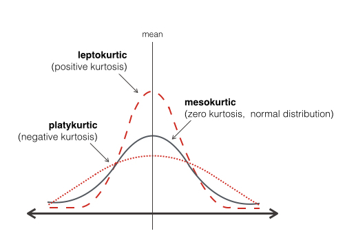
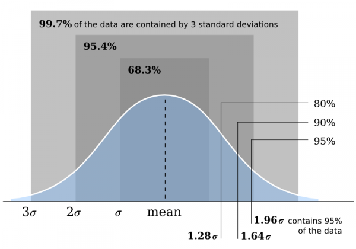
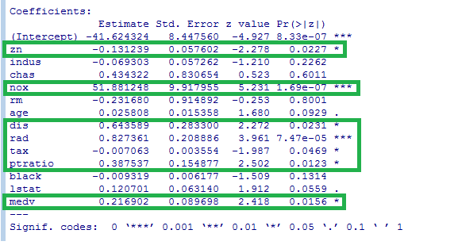

# Table of Contents

* [Table of Contents](#table-of-contents)
* [Introduction](#introduction)
* [Model Accuracy](#model-accuracy)
* [Model Kappa](#model-kappa)
* [Area Under the Curve (AUC)](#area-under-the-curve-auc)
* [Kertosis](#kertosis)
  * [Mesokurtic](#mesokurtic)
  * [Leptokurtic](#leptokurtic)
  * [Platykurtic](#platykurtic)
* [Standard Normal Distribution](#standard-normal-distribution)
* [Feature scaling](#feature-scaling)
* [P-Values for Linear Regression Terms](#p-values-for-linear-regression-terms)

# Introduction

This is a living document I'll add to as appropriate.  The purpose is mostly serve as a reminder to myself when I invariably forget something. ;)

So, let's start!

# Model Accuracy


Image credit:  www.mmtpl.com


In order to assess accuracy we first train a model on a known set of data.  After the model is trained a number of observations the model hasn’t seen are fed through, and the classification assignments for the unseen records output by the model are recorded.  The model’s classification assignments are then compared against the actual classification assignments, and a percentage of correct classifications is computed.

So after training a model and giving it some new data we might see output similar to this:

```R
result 	No  Yes
No      52  5
Yes     15  55
```

The rows in the table above are the actual classifications, and the columns are what the model predicted based on its training.  The table can be rewritten like this:

|result 		   |Predicted: No|Predicted: Yes|Total|
|------------------|-------------|--------------|-----|
|Actual: No  	   |52   		 |5				|57	  |
|Actual: Yes 	   |15  		 |55			|70	  |
|Total			   |67			 |60            |	  |

```
Total correct classification: 52 + 55 = 107
Total observations: 127
```

So in this example the model incorrectly classified five observations as “Yes” when in fact they should have been classified as “No.”   Likewise it incorrectly classified fifteen “Yes” observations as “No.”

And to calculate the accuracy we can add up the number of correct classifications and then divide them by the total observations:
```(52+55)/(52+55+15+5) = .8425```

We can now say that this model has an 84.25% accuracy rating based on the predictions it made against a previously unseen set of data (usually called the “test” data set).

If you want to learn more [this](http://www.dataschool.io/simple-guide-to-confusion-matrix-terminology/) is a great overview.

# Model Kappa

I think the best way to explain kappa is to start with an example([1](https://stats.stackexchange.com/questions/124001/what-is-the-intuition-behind-the-kappa-statistical-value-in-classification)):

```R
# Example 1:  A balanced dataset
tab[1,1] <- 45
tab[1,2] <- 5
tab[2,1] <- 5
tab[2,2] <- 45

   pred
act  A    B
A    45   5
B    5    45

Accuracy : 0.9            
Kappa : 0.8            
```

```R
# Example 2: An unbalanced datasest
tab[1,1] <- 85
tab[1,2] <- 5
tab[2,1] <- 5
tab[2,2] <- 5

   pred
act  A    B
A    85   5
B    5    5

Accuracy : 0.9                                        
Kappa : 0.444            
```

First, notice both examples give the same accuracy rating:  90%.  However, what if what we really cared about was the “B” label, and we were using it to make a cancer diagnosis or identify fraudulent activity?  In that case “Example 2: An unbalanced dataset” would be returning the wrong classification **50% of the time** for the variable we were most concerned with!  Even though Example 2 had a high accuracy rating, that statistic is being skewed by the unbalanced data set and hence the kappa value of 0.444.
  
Clearly using Example 2 would be a disaster; imagine telling someone they had cancer and only having a 50% chance of actually being correct....

So we can use the kappa statistic to control for unbalanced data sets and keep a high accuracy rate from masking an underlying flaw in the model.

And to steal a few explanations from outside sources:

> The way it [kappa] is usually described is the amount of agreement correct by the agreement expected by chance. 
> However, it technically isn't corrected by chance but instead reports if the agreement is greater than by chance. 
> Although the Kappa statistic is widely used, I believe it is most generally applied to predictive models built 
> from unbalanced data (i.e. class distributions not equivalent).
([2]( https://stats.stackexchange.com/questions/124001/what-is-the-intuition-behind-the-kappa-statistical-value-in-classification))

>The Kappa statistic (or value) is a metric that compares an Observed Accuracy with an Expected Accuracy (random 
> chance). The kappa statistic is used not only to evaluate a single classifier, but also to evaluate classifiers
> amongst themselves. In addition, it takes into account random chance (agreement with a random classifier), which
> generally means it is less misleading than simply using accuracy as a metric (an Observed Accuracy of 80% is a
> lot less impressive with an Expected Accuracy of 75% versus an Expected Accuracy of 50%).
([3](https://stats.stackexchange.com/questions/82162/cohens-kappa-in-plain-english))

So let’s review the example we used in the Accuracy section above and calculate the kappa value for it:

|result 		   |Predicted: No|Predicted: Yes|Total|
|------------------|-------------|--------------|-----|
|Actual: No  	   |52   		 |5				|57	  |
|Actual: Yes 	   |15  		 |55			|70	  |
|Total			   |67			 |60            |	  |

```
Total correct classification: 52 + 55 = 107
Total observations: 127
```

```
Kappa = (observed accuracy - expected accuracy)/(1 - expected accuracy)
Ground truth: No (57), Yes (70) 
Machine Learning Classifier: No (67), Yes (60) 
Total: (127) 
Observed Accuracy: ((52 + 55) / 127) = 0.84
Expected Accuracy: ((57 * 67 /127) + (70 * 60 / 127)) /127 = 0.50
Kappa: (0.84 - 0.50) / (1 - 0.50) = 0.68
```

So the kappa for this model is 0.68, and the accuracy we arrived at earlier was 84.25%.  Now that we see a kappa value of 0.68 the 84.25% accuracy figure frankly isn’t as impressive, and it would be even less so for smaller kappa values.


# Area Under the Curve (AUC)

When dealing with classification problems typically the chances that a particular observation is classified one way or another is given as a probability.  So in the case of a binary classification problem we might have one observation with only a 0.22 probability of being “Yes,” while perhaps a second observation has a great “Yes” probability of 0.74.

In order to decide where the cutoff is between “Yes” or “No” a `threshold` is specified.  This is simply a value that divides the assignment of an observation into one class or another.  So for example we might set a threshold of 0.5.  This means any observation with a probability of 0.5 or greater will be assigned “Yes,” and an observation with a probability of less than 0.5 will be assigned “No.”  

As we alter the threshold value the classification error rates of the model will change.  So for example a threshold of 0.9 will make it more difficult for an observation to be labeled as “Yes,” and so the number of correct classifications for “Yes” will increase.  However now some observations that might have been assigned to “Yes” will be classified as “No,” and so the number of incorrect classifications for “No” will also increase.  If we lower the threshold then the inverse holds true:  Incorrect classifications for “Yes” will increase; incorrect classifications for “No” will decrease.

Typically the chosen threshold value will be determined by domain knowledge of the problem.  Perhaps in the case of cancer diagnosis the threshold should be high; the impact of telling someone they have cancer if you’re not almost 100% certain is simply too great.  On the other hand perhaps if we’re testing aircraft engines for defects we’d rather be overly cautious and set the threshold low.  It’s OK if some engines are flagged as problematic and sent back through testing again vs. having them malfunction midflight.

One tool to visualize the tradeoffs for various threshold values is the `ROC curve`.  It graphs the true positive rate against the false positive rate for all possible thresholds.  Here is an example of what an ROC curve looks like:


Image credit:  i.stack.imgur.com

When examining an ROC curve the more the line hugs the top left corner of the graph the better.  We can then measure the area under the curve (AUC), and obtain a numeric metric for the threshold vs. error rate performance.  The maximum value the AUC can ever have is one, so the closer to one the AUC score is the better.  

So given two models we’d prefer the one with a larger AUC metric, as it will give us more correct results overall irrespective of the threshold value selected.  It would also be nice to know the model will function consistently over a range of thresholds vs. having a spike in the graph for certain threshold values.  The latter case would likely indicate some problem with the model that would warrant further investigation.

You can read more about the AUC [here](http://fastml.com/what-you-wanted-to-know-about-auc/) and [here](https://en.wikipedia.org/wiki/Receiver_operating_characteristic).

# Kertosis

In a nutshell Kertosis describes the measure of the thickness of the tails in a distribution.  The Kertosis of a distribution can fall into one of three categories:

* Mesokurtic
* Leptokurtic
* Platykurtic



Image credit:  http://versionone.vc

## Mesokurtic

> Kurtosis is typically measured with respect to the normal distribution. A distribution that has tails shaped in roughly the same way as any normal distribution, not just the standard normal distribution, is said to be mesokurtic. The kurtosis of a mesokurtic distribution is neither high nor low, rather it is considered to be a baseline for the two other classifications.  ([4](https://www.thoughtco.com/what-is-kurtosis-3126241]))

> The kurtosis of any univariate normal distribution is 3. It is common to compare the kurtosis of a distribution to this value.  ([5](https://en.wikipedia.org/wiki/Kurtosis]))

## Leptokurtic

> Distributions with kurtosis greater than 3 are said to be leptokurtic. An example of a leptokurtic distribution is the Laplace distribution, which has tails that asymptotically approach zero more slowly than a Gaussian, and therefore produces more outliers than the normal distribution.  ((5)[https://en.wikipedia.org/wiki/Kurtosis])

> Leptokurtic distributions are sometimes identified by peaks that are thin and tall. The tails of these distributions, to both the right and the left, are thick and heavy. Leptokurtic distributions are named by the prefix "lepto" meaning "skinny."  ([4](https://www.thoughtco.com/what-is-kurtosis-3126241]))

## Platykurtic

> Distributions with kurtosis less than 3 are said to be platykurtic, although this does not imply the distribution is "flat-topped" as sometimes reported. Rather, it means the distribution produces fewer and less extreme outliers than does the normal distribution. An example of a platykurtic distribution is the uniform distribution, which does not produce outliers.  ([5](https://en.wikipedia.org/wiki/Kurtosis]))

> Platykurtic distributions are those that have slender tails.  Many times they possess a peak lower than a mesokurtic distribution. The name of these types of distributions come from the meaning of the prefix "platy" meaning "broad."    ([4](https://www.thoughtco.com/what-is-kurtosis-3126241]))

# Standard Normal Distribution

(This is also called the Gaussian or Gauss or Laplace-Gauss distribution.

A Standard Normal Distribution is a continuous probability distribution in which
* The mean = the median = the mode
* There is symmetry about the center
* 50% of the distribution values are less than the mean
* 50% of the distribution values are greater than the mean



Image credit:  http://subsurfwiki.org


# Feature scaling

> Feature scaling is a method used to standardize the range of independent variables or features of data. In data processing, it is also known as data normalization and is generally performed during the data preprocessing step.

> Since the range of values of raw data varies widely, in some machine learning algorithms, objective functions will not work properly without normalization. For example, the majority of classifiers calculate the distance between two points by the Euclidean distance. If one of the features has a broad range of values, the distance will be governed by this particular feature. Therefore, the range of all features should be normalized so that each feature contributes approximately proportionately to the final distance.

> Another reason why feature scaling is applied is that gradient descent converges much faster with feature scaling than without it.  ([6](https://en.wikipedia.org/wiki/Feature_scaling]))

# P-Values for Linear Regression Terms

The P-Value for each linear regression term determines if the null hypothesis for that term can be accepted or rejected.  Typically P-Values that are less than 0.05 are considered statistically significant terms, and the null hypothesis is rejected.  P-Values equal to or greater than 0.05 are not considered statistically significant terms, and the null hypothesis is accepted.



In the image above we are examining a logistic regression model summary in R for the Boston data set.  By examining the term P-Values that are less than 0.05--circled in green--we can determine which terms (i.e. explanatory variable) are statistically significant for predicting the response variable.

# Breaking symmetry

> During forward propagation each unit in hidden layer gets signal.  

> That is, each hidden unit gets sum of inputs multiplied by the corresponding weight.

> Now imagine that you initialize all weights to the same value (e.g. zero or one). In this case, each hidden unit will get exactly the same signal. E.g. if all weights are initialized to 1, each unit gets signal equal to sum of inputs (and outputs sigmoid(sum(inputs))). If all weights are zeros, which is even worse, every hidden unit will get zero signal. No matter what was the input - if all weights are the same, all units in hidden layer will be the same too.

> This is the main issue with symmetry and reason why you should initialize weights randomly (or, at least, with different values).  Note, that this issue affects all architectures that use each-to-each connections.  [Source](https://stackoverflow.com/questions/20027598/why-should-weights-of-neural-networks-be-initialized-to-random-numbers)


