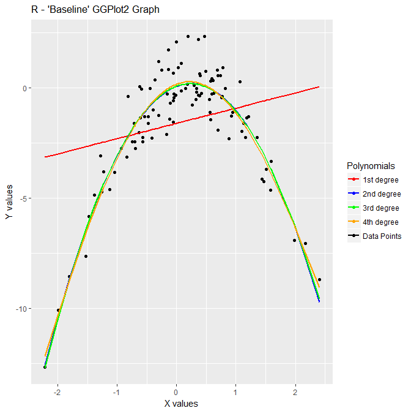
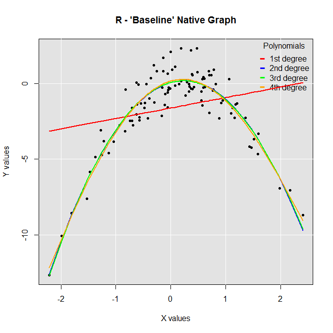
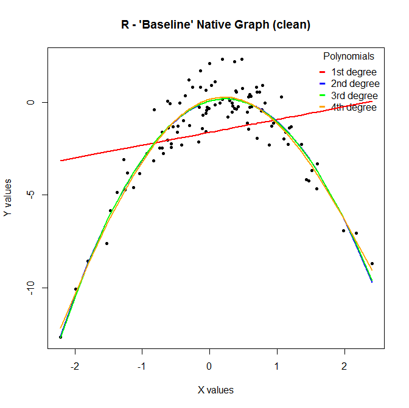
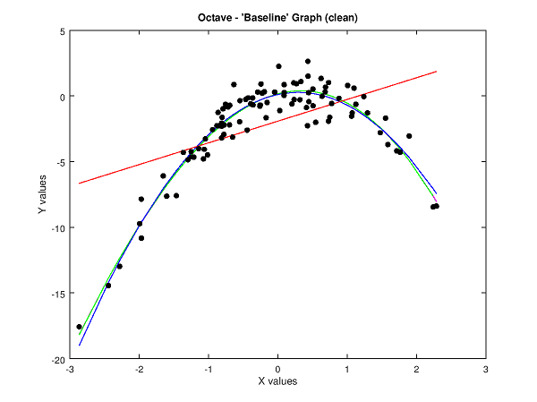

# Graphing in R and Octave

More often than not if you are creating a graph you are going to end up showing it to someone, and when that happens it can be important that your graph is aesthetically pleasing.  (And this is doubly so when your audience isn't technical!)  While you or I might be entranced by the numbers and trends intimated by the graph, others may not be as enamored…

For example, I often find myself using the graphical outputs of calculations and analysis to argue some point, push a policy, or gain traction for a new initiate.  At those times I'm operating in more of a sales mode than as a data analyst.  I need to quickly get my audience’s focus and convince them to commit the time/resources/people to my idea.  So, like any good marketing effort, I need something flashy that will grab my audience's attention long enough for the salient points of my "pitch" to start sinking in.

So for this write-up I wanted to explore some quick-and-dirty graphing in R and Octave.  More specifically, I wanted to examine three graphing options that might help us with our goal above:  Graphing in R natively, graphing in R using GGPlot, and graphing in Octave.  I wanted the output to be aesthetically pleasing enough to gain some one's attention glancing over it on a slide or presentation, but I don't want to spend a twenty-hour week creating the next Mona Lisa of infographics.

## Graphing in R

Let's cover R first:  We’ll begin by creating a toy data set along with a set of four polynomial regression models.  Next, we’ll create a set of predictions utilizing the polynomial regression models.  Finally, we’ll plot the predictions of each model on our graph along with the original data points, so we can visually inspect how well each model's predictions fits against our source data set.

### Problem setup

```r
#R - Problem setup
# Create our data set
set.seed(1)
x=rnorm(100)
y=x-2*x^2+rnorm(100)
df = data.frame(x,y)

# Create four polynomial regression models for the data set
gfit1=glm(y~poly(x,1))
gfit2=glm(y~poly(x,2))
gfit3=glm(y~poly(x,3))
gfit4=glm(y~poly(x,4))

# Make our predictions utilizing the four polynomial regression models
pre1=predict(gfit1,df,type="response")
pre2=predict(gfit2,df,type="response")
pre3=predict(gfit3,df,type="response")
pre4=predict(gfit4,df,type="response")
```

### GGPlot

Now let's utilize GGPlot to create our first graph.  I personally like the way GGPlot looks "out of the box," so I don't spend a lot of time tweaking the visuals.  Having said that; however, I also subscribe to Cole Nussbaumer Knaflic's theory that the less "clutter" you have in your graphs the better; removing the grey background and grid lines at some point would probably be a positive thing.

(As a side note, here is a good resource for further discussion on improving the impact of your graphs and charts:  [Storytelling with Data](http://www.storytellingwithdata.com/))

```r
#R - GGPlot

# Load in the GGPlot library
library(ggplot2)

# Draw the graph, grid lines, axis tick marks, title, legend, etc.
plot = ggplot(data=df, aes(x=df$x, y=df$y, color="Data Points")) 
plot = plot + ggtitle("R - 'Baseline' GGPlot2 Graph") + xlab("X values") + ylab("Y values")
cols = c("Data Points"="black", "1st degree"="red", "2nd degree"="blue", "3rd degree"="green", "4th degree"="orange")
plot = plot + scale_color_manual(name="Polynomials", values=cols)

# Plot the data set on the graph
plot = plot + geom_point()

# Plot the prediction values generated from our models onto the graph
plot = plot + geom_line(aes(x,pre1, color="1st degree"), size=1)
plot = plot + geom_line(aes(x,pre2, color="2nd degree"), size=1)
plot = plot + geom_line(aes(x,pre3, color="3rd degree"), size=1)
plot = plot + geom_line(aes(x,pre4, color="4th degree"), size=1)

# Render the graph
plot
```

And here is the end result:



**_Figure 1 - Graph Utilizing GGPlot2 in R_**


Not too shabby looking.  So, if we use the output of GGPlot as our "baseline," what would it take to replicate this utilizing R's native plotting functionality?  Let's find out!

### R's Native Graphing

```r
#R - Native Graphing

# Plot the data set on the graph, set the title, axis labels, etc.
plot(x, y, pch=20, cex=1, main="R - 'Baseline' Native Graph", xlab="X values", ylab="Y values")

# Now we need to do some magic to fill in the background of the plot area with a light grey background...
# This next command creates a vector of the form c(x1, x2, y1, y2) giving the extremes of the user coordinates of the plotting region.
u <- par("usr")

# Now we can draw a rectangle the same size as our plotting area and fill it in
rect(u[1], u[3], u[2], u[4], col = "grey89", border = "black") 

# Draw our grid lines similiar to what saw in GGPlot's rendering
grid(col="white", lty="solid")

# Draw the data set on the graph again since it was covered up by our background layer
points(x, y, pch=20, cex=1)
# Add the legend
legend("topright", 
  title = "Polynomials",
  legend = c("1st degree", "2nd degree", "3rd degree", "4th degree"),  #Labels for the symbols
  col = c("red", "blue", "green", "orange"),  #Colors to draw the legend symbols in
  pch = c("-", "-", "-", "-"),  #Legend symbols to draw
  bty = "n",  #'n' = no legend border.  'o' = legend border.
  pt.cex = 2,  #Size of the symbols
  cex = 1,  #Size of the text
  text.col = "black",  #Color of the text
  horiz = F,  #Legend in column or in row? 
);

# Plot the prediction values generated from our models onto the graph
# Note that in order to have a line connect each data point as you'd expect we have to sort them first...
# More information on this [here](https://stackoverflow.com/questions/33700186/line-connecting-the-points-in-the-plot-function-in-r)
lines(x[order(x)], pre1[order(x)], xlim=range(x), ylim=range(pre1), col="red", lwd=2)
lines(x[order(x)], pre2[order(x)], xlim=range(x), ylim=range(pre2), col="blue", lwd=2)
lines(x[order(x)], pre3[order(x)], xlim=range(x), ylim=range(pre3), col="green", lwd=2)
lines(x[order(x)], pre4[order(x)], xlim=range(x), ylim=range(pre4), col="orange", lwd=2)
```



**_Figure 2 - Graph Utilizing Native Plotting in R_**

So now we know what it would take to draw the same graph using R's native graphing functionality vs. the GGPlot library.  I still prefer GGPlot's implementation, but it's not that much more effort to do it using R natively.  And if we wanted a cleaner graph we get that "out of the box" by skipping this part of the R native code:

```r
# Skip this stuff for a "cleaner" looking graph...
u <- par("usr")
rect(u[1], u[3], u[2], u[4], col = "grey89", border = "black") 
grid(col="white", lty="solid")
points(x, y, pch=20, cex=1)
```



**_Figure 3 - Graph Utilizing Native Plotting in R (clean)_**


### "Clean" GGPlot Graph

To get the same "clean" graph in GGPlot we could do this:

```r
#R - GGPlot ("clean")

# Load in the GGPlot library
library(ggplot2)

# Draw the graph, grid lines, axis tick marks, title, legend, etc.
plot = ggplot(data=df, aes(x=df$x, y=df$y, color="Data Points")) 
plot = plot + ggtitle("R - 'Baseline' GGPlot2 Graph (clean)") + xlab("X values") + ylab("Y values")
cols = c("Data Points"="black", "1st degree"="red", "2nd degree"="blue", "3rd degree"="green", "4th degree"="orange")
plot = plot + scale_color_manual(name="Polynomials", values=cols)

# Remove the background, grid lines, and outline
plot = plot + theme(panel.grid.major = element_blank(), panel.grid.minor = element_blank(), panel.background = element_blank())

# Plot the data set on the graph
plot = plot + geom_point()

# Plot the prediction values generated from our models onto the graph
plot = plot + geom_line(aes(x,pre1, color="1st degree"), size=1)
plot = plot + geom_line(aes(x,pre2, color="2nd degree"), size=1)
plot = plot + geom_line(aes(x,pre3, color="3rd degree"), size=1)
plot = plot + geom_line(aes(x,pre4, color="4th degree"), size=1)

# Render the graph
plot
```


**_Figure 4 - Graph Utilizing GGPlot2 in R (clean)_**

So at this point we have two graphs we could easily utilize in a presentation or supporting document that look fairly attractive.  What would it take to create the same graph in Octave?

## Graphing in Octave

```octave
# Octave - Problem setup
# Create our data set
rand('state', [1; 2; 3])
x = randn(1,100);
y=x-2*x.^2+randn(1,100);

# Create four polynomial regression models for the data set, and 
# make our predictions utilizing those same four models
fit1 = polyfit(x, y, 1);
fit2 = polyfit(x, y, 2);
fit3 = polyfit(x, y, 3);
fit4 = polyfit(x, y, 4);
pre1 = polyval(fit1,x);
pre2 = polyval(fit2,x);
pre3 = polyval(fit3,x);
pre4 = polyval(fit4,x);

# We are sorting the X values for same reason we did this in R...  Allows us to draw lines between our data points in the way
# you intitivly expect it to 
[x_sort index]=sort(x);

# Render the graph, add title, labels, legend, etc.
plot(x_sort,y(index), 'o', 'markersize', 5, 'markerfacecolor', 'k', 'markeredgecolor', 'k');
title ('Octave - "Baseline" Graph');
xlabel ('X values');
ylabel ('Y values');
grid('off');

# Tell Octave we want to add additional elements to the graph
hold on;

# Plot the prediction values generated from our models onto the graph
plot(x,pre1,'r-'); 
plot(x_sort,pre2(index),'b-'); 
plot(x_sort,pre3(index),'g-'); 
plot(x_sort,pre4(index),'m-'); 

# Tell Octave we are finished adding elements to the graph
hold off;
```


**_Figure 5 - 'Baseline' Graph Rendered in Octave_**



**_Figure 6 - 'Baseline' Graph Rendered in Octave (clean)_**

(You might notice we didn't set the background to a light grey to exactly copy our "baseline" graph in R-GGPlot.  That's because at the time of writing this there doesn't seem to be support for that.)

And there you have it:  The same graph we produced in R with a 'clean' version to boot.

## Final Thoughts

Frankly all three methods seem to take about the same amount of effort.  Likely it's going to come down to whichever application/method the person creating the graph is most comfortable with.  For me personally, I think I'd go with Octave if I was creating a graph that was going to be viewed by a non-technical audience who might allow the "sexy" factor to sway their decisions.  

(And yes, this is absolutely something you have to consider.  I remember reviewing a product update where we had stuffed a ton of new, advanced features in with our top clients, and we spent about 90% of the meeting with them talking about who liked portrait vs. landscape better on their phone and the gradient shading on some buttons.)

To me the Octave graph just looks better somehow, but any of them would work.

