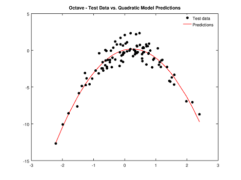

# Summary
Before we start delving into the write-ups of more complicated models such as neural networks I wanted to compare a number of methods to create models on a simple data set and ensure we received the same predictions for each.  I think this is important, because we may not always get exactly the same thetas, costs, and predictions between two advanced models.  However, many of the more complicated models utilize cost functions, gradients, etc., and so if we know these computational components are working as expected we'll have more confidence in the outputs of our advanced models.

For example, in a neural network we'll likely be utilizing some cost function which will possibly leverage one of the methods below.  If we understand and have verified the accuracy of the cost functions we'll be able to put a lot more faith into the output and predictions of the neural network.  We'll also have a number of model components at hand to utilize, so we can hopefully pick the simplest method that still meets the requirements of the project.


# R
```r
library(R.matlab)

set.seed(1)
x=rnorm(100)
y=x-2*x^2+rnorm(100)
df = data.frame(x,y)
plot(df)

writeMat("dataSet1.mat", dataSet=df)

# Create four polynomial regression models for the data set
gfit1=glm(y~poly(x,1))
gfit2=glm(y~poly(x,2))
gfit3=glm(y~poly(x,3))
gfit4=glm(y~poly(x,4))
```

We'll use a 2nd degree polynomial function, as an ANOVA test doesn't show much benefit from using a more complicated model:

```r
anova(gfit1,gfit2,gfit3,gfit4)

Analysis of Deviance Table

Model 1: y ~ poly(x, 1)
Model 2: y ~ poly(x, 2)
Model 3: y ~ poly(x, 3)
Model 4: y ~ poly(x, 4)
  Resid. Df Resid. Dev Df Deviance
1        98     662.55            
2        97      89.03  1   573.52
3        96      88.96  1     0.07
4        95      87.38  1     1.58
```

The sum of square errors (SSE) for the polynomial functions (3rd column in the output above) decreases signifigantly for a quadratic function, and then the reduction in SEE tapers off sharply as we evaulate cubic and quartic functions.

Note:  We could also compute the SEE manually for a given model with the following command:  `sum(gfit2$residuals^2)`

OK, now that we have chosen a model let's make some predictions and plot them:

```r
# Create our set of predictions utilizing the quadratic model
pre2=predict(gfit2,df,type="response")

# Graph the predictions vs. the true data points
library(ggplot2)
cols = c("Test Data"="black", "Predictions"="red")
plot = ggplot(data=df, aes(x=df$x, y=df$y, color="Test Data")) + geom_point()
plot = plot + scale_color_manual(name="", values=cols)
plot = plot + ggtitle("R - Test Data vs. Quadratic Model Predictions") + xlab("X values") + ylab("Y values")
plot = plot + geom_line(aes(x,pre2, color="Predictions"), size=1)
plot

# View a sample of the calculated prediction values:
pre2
            1             2             3             4             5             6             7 
 -1.412048007   0.172049470  -2.272843798  -3.713114487   0.161814766  -2.204224058   0.049080467 
```


 
We can also utilize the summary() command to view the optimized theta values for our model (the values in the "Estimate" column in the output below):

```r
summary(gfit2)

Call:
glm(formula = y ~ poly(x, 2))

Deviance Residuals: 
    Min       1Q   Median       3Q      Max  
-1.9650  -0.6254  -0.1288   0.5803   2.2700  

Coefficients:
            Estimate Std. Error t value Pr(>|t|)    
(Intercept)  -1.5500     0.0958  -16.18  < 2e-16 ***
poly(x, 2)1   6.1888     0.9580    6.46 4.18e-09 ***
poly(x, 2)2 -23.9483     0.9580  -25.00  < 2e-16 ***
---
Signif. codes:  0 ‘***’ 0.001 ‘**’ 0.01 ‘*’ 0.05 ‘.’ 0.1 ‘ ’ 1

(Dispersion parameter for gaussian family taken to be 0.9178258)

    Null deviance: 700.852  on 99  degrees of freedom
Residual deviance:  89.029  on 97  degrees of freedom
AIC: 280.17

Number of Fisher Scoring iterations: 2
```

 
# Octave
OK, now let's compare how to do the same thing in Octave using 1) Octave's built-in functions, and 2) doing it "by hand."  

We'll setup the environment first:

```Matlab
% Let's use the same data set we created in R for consistency and comparison purposes
load("dataSet1.mat")
x = getfield(dataSet1,'x');
y = getfield(dataSet1,'y');
plot(x,y,'o');
pause;
```

## Octave's built-in functions, polyfit and polyval

Creating the polynomial models is straightforward using polyfit and polyval:

```Matlab
fit1 = polyfit(x, y, 1);
fit2 = polyfit(x, y, 2);
fit3 = polyfit(x, y, 3);
fit4 = polyfit(x, y, 4);
```

We already know from our work in R we want to use the quadratic function, but we could calculate the SEE values in Octave as well if we wished:

```Matlab
pre1 = polyval(fit1,x);
pre2 = polyval(fit2,x);
pre3 = polyval(fit3,x);
pre4 = polyval(fit4,x);

sum((pre1 - y).^2)
sum((pre2 - y).^2)
sum((pre3 - y).^2)
sum((pre4 - y).^2)

% ans =  662.55
% ans =  89.029
% ans =  88.959
% ans =  87.379
```

Notice we achieve the same results as we did in R.  Next we'll graph the predictions vs. the test data, and visually inspect a sample of the calculated prediction values:

```Matlab
[x_sort index]=sort(x);
plot(x_sort,y(index), 'o', 'markersize', 5, 'markerfacecolor', 'k', 'markeredgecolor', 'k');
title ('Octave - Test Data vs. Quadratic Model Predictions');
hold on;
plot(x_sort,pre2(index),'r-');
h = legend ("Test data", "Predictions");
legend (h, "location", "northeast");
legend boxoff;
hold off;

pre2(1:5,:)
ans =
   -1.412048
    0.172049
   -2.272844
   -3.713114
    0.161815
 
# Calculate one of our prediction values by hand using the model coefficients
polyfit(x, y, 2)
ans =
  -2.118921   1.017161   0.056715
  
2.118921*x(1,:)^2 + 1.017161*x(1,:) + 0.056715
ans = -1.4120
``` 


 
Again, we confirm everything lines up and is equal with our results in R.

## "By hand" in Octave utilizing gradient descent 

Next we'll perform our calculations and come up with an optimized model by doing the work "by hand" in Octave with gradient descent:

```Matlab
% We are writing our main script like this, so that we can have more than one
% function present in the same file.  Makes it easier to do write-ups in github...
function [] = main()

  % Load the data set we created in R previously
  load("dataSet1.mat")
  x = getfield(dataSet1,'x');
  y = getfield(dataSet1,'y');
  plot(x,y,'o');

  % Add our second term--since we want a quadratic model--to the x matrix along w/ the bias unit (i.e. intercept term)
  X = [ones(length(x), 1), x, (2*x.^2)];

  % Initialize theta (placeholders for the intercept, x, and 2*x^2 term coefficients)
  theta = zeros(3, 1);	

  % Some gradient descent settings
  iterations = 1500;
  alpha = 0.01;

  theta = gradientDescent(X, y, theta, alpha, iterations);
  theta
  pre = X*theta;
  pre(1:5,:)
  
  % Plot the predictions vs. data points
  hold on;
  [x_sort index]=sort(x);
  plot(x_sort,pre(index),'r-'); 
  hold off;

end

% Calculate the cost (squared sum of errors) for a particular set of x, y, and theta values
function J = modelCost(X, y, theta)
  % Initialize vars
  m = length(y); % Number of training examples
  J = 0;         % Final return value

  % Need to calc J(0) = (1/2m) * sum(h(0)x - y)^2

  % Calc h(0)x first which is given by X*theta
  h0 = X*theta;
  % Next calc square of errors 
  sqErrs = (h0 - y ).^2;
  % Now finalize cost value using formula 
  cost = 1/(2*m) * sum(sqErrs);
  % Return final cost value
  J = cost;
end


% Perform gradient descent by taking iteration number of gradient steps with learning rate alpha
% to determine optimal theta (i.e. theta values w/ least cost)
function [theta, J_history] = gradientDescent(X, y, theta, alpha, iterations)
  % Initialize vars
  m = length(y); % number of training examples
  J_history = zeros(iterations, 1);

  for iter = 1:iterations 
      n = size(X,2);
      for i = 1:n;
        cost = theta(i) - (alpha/m * sum(((X*theta) - y) .*X(:,i)));
        theta(i) = cost;  
      endfor;

      % Save the cost J in every iteration in case we want to plot the function's performance...
	  % The cost should go down every iteration until the minima is reached
      J_history(iter) = modelCost(X, y, theta);
  end

end
```

Again we see the same predicted values calculated as for the other methods we explored above even though gradient descent gave us a different theta matrix.

```Matlab
theta =
   0.056701
   1.017154
  -1.059457

first five predictions =
  -1.41205
   0.17203
  -2.27285
  -3.71312
   0.16180
```

## "By hand" in Octave utilizing the [Normal Equation](http://mathworld.wolfram.com/NormalEquation.html)

Compared to our last method this one is pretty simple:

```Matlab
X = [ones(length(x), 1), x, (2*x.^2)];
theta = (pinv(X'*X))*X'*y
pre = X*theta;
pre(1:5,:)
```

And again, we get the same predicted values:

```Matlab
ans =
  -1.41205
   0.17205
  -2.27284
  -3.71311
   0.16181
```

## Octave's built-in functions, ols and fminunc

We'll consider two other methods, and then wrap up.

First is the [ols](https://octave.sourceforge.io/octave/function/ols.html) function:

```Matlab
[beta, sigma, r] = ols (y, X);
beta
beta =

   0.056715
   1.017161
  -1.059461
```

We can see this gives us the same optimized theta values as gradient descent and the Normal Equation.

And now for a fminunc implementation:

```Matlab
% We are writing our main script like this, so that we can have more than one
% function present in the same file.  Makes it easier to do write-ups in github...
function [] = main()
  % Load the data set we created in R previously
  load("dataSet1.mat")
  x = getfield(dataSet1,'x');
  y = getfield(dataSet1,'y');
  plot(x,y,'o');
  
  %  Set options for fminunc
  options = optimset('GradObj', 'on', 'MaxIter', 400);
  
  initTheta = zeros(3, 1);
  X = [ones(length(x), 1), x, (2*x.^2)];
  [theta, cost] = fminunc(@(t)(modelCost(X, y, t)), initTheta, options);
  theta
end
	
% Calculate the cost (squared sum of errors) for a particular set of x, y, and theta values
function [J , gradient] = modelCost(X, y, theta)
  % Initialize vars
  m = length(y); % number of training examples
  J = 0;         % final return value

  % Need to calc J(0) = (1/2m) * sum(h(0)x - y)^2

  % Calc h(0)x first which is given by X*theta
  h0 = X*theta;
  % Next calc square of errors 
  sqErrs = (h0 - y ).^2;
  % Now finalize cost value using formula 
  cost = 1/(2*m) * sum(sqErrs);
  % Assign cost
  J = cost;
  % Assign derivative term (theta values)
  gradient = (1/m) .* X' * (X * theta - y);
end	
```

Again we find the same theta values which will result in the same predictions as our other models:

```Matlab
theta =
   0.056715
   1.017161
  -1.059461
```
