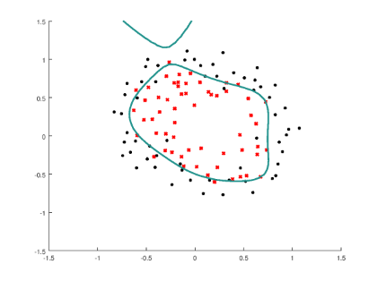
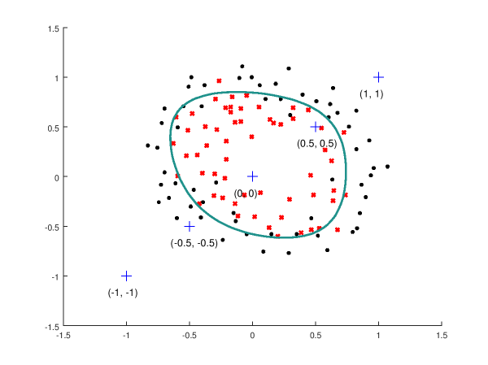

# Introduction

During the [last write-up](../Linear-Regression-P1) we compared a number of methods to create linear regression models in R and Octave.  This write-up is similar except now we're going to examine logistic regression models in R and Octave.  And, to make this more interesting, we'll consider an example data set that will require a model that will output a non-linear decision boundary.

# Octave

## Code

So first let's take a look at our Octave code, and then we'll make some comments.  Also please note that for space purposes the full script isn't being shown.  However, if you wish you can read through it [here](./fullLogisticRegressionScript.m).

```Matlab
function [] = main()
  
  % Close any graphs we have open from other processes
  close all;
  
  % Load our sample data set
  data = load('dataSet.txt');

  % Split our data up into x and y variables, so we can work with it easier later on
  % x contains rows of two data points, x1 and x2
  x = data(:, [1, 2]); 
  x1 = x(:,1);
  x2 = x(:,2);
  % y contains a binary classification [0|1] for each set of explanatory variables, x1 and x2
  y = data(:, 3);
  
  % Let's examine our sample data set (which upon visual inspection is clearly non-linear)
  plotData(x, y);
  fprintf('\nProgram paused. Press enter to continue.\n');
  pause;
  
  % Perform the regularized logistic regression to formulate our model
  
  % Since our data set is non-linear we'll need to add additional features to come up with a good model
  % In this case we'll add polynomial features up to degree six
  degree = 6;
  
  % Create our new polynomial feature matrix including a bias unit
  % x1, x2, x1.^2, x2.^2, x1*x2, x1*x2.^2, etc..
  X = mapFeature(x1, x2, degree);
 
  % Initialize fitting parameters
  initTheta = zeros(size(X, 2), 1);
  
  % Set fminunc options
  options = optimset('GradObj', 'on', 'MaxIter', 400);

  % Set regularization parameter lambda to 1
  lambda = 1;
  
  % Calculate optimal values of theta
  [theta, J, exit_flag] = fminunc(@(t)(costFunction(t, X, y, lambda)), initTheta, options);
   
  % Plot optimized non-linear decision boundary with lamba = 1
  % We'll also take a look at how smooth the decision boundary lines are depending on 
  % how many prediction values ask our graphing function to calculate (i.e. the 4th parameter)
  figure(1);
  plotDecisionBoundary(theta, X, y, 100, degree);
  figure(2);
  plotDecisionBoundary(theta, X, y, 10, degree);
  
  % Compute accuracy on our training set
  p = predict(theta, X);
  fprintf('\nTrain Accuracy: %f  (lamba = %f)\n', mean(double(p == y)) * 100, lambda);

end
```

## Commentary

Once the script above is executed two graphs will be output:

### Data Set Graph

The first graph (Figure 1) illustrates the test data set with different markers (black dots vs red asterisks) drawn depending on the 'y' label of the data point (one or zero).


**_Figure 1 - Sample Data Set_**

### Decision Boundary Graph

The second graph (Figure 2) depicts the test data set along with the decision boundary formulated by the logistic regression model optimized by the script. 


**_Figure 2 - Sample Data Set with Computed Decision Boundary_**

### Lambda Graphs

#### Overfitting

In this case we utilized a lambda value of 1 in an attempt to find the right balance between underfitting and overfitting.  If we use a lambda value of .001 for example, the resulting graph suffers from too much overfitting.  Clearly this model will be deficient when we feed data into it that the algorithm hasn't seen before. 



**_Figure 3 - Overfitting (Lambda = .001)_** 

#### Underfitting

And looking at the same plot with a lambda of 100 gives the exact opposite problem:  The model is so underfit that the decision boundary calculated really makes no sense, and it does a poor job of properly classifying observations.  This is also evident looking at the training accuracy:  It goes from 83.1% percent with lambda = 1 down to 61.0% with lambda = 100.


**_Figure 4 - Underfitting (Lambda = 100)_** 


(We should also note that in a more serious example the lambda parameter would be found in a much more rigorous way utilizing cross validation or other means of assessing the efficacy of a generated model...)

## Testing the Model

Now that we have a logistic regression model created to handle our non-linear data it would be nice to test it out.  In order to do this we'll take a set of arbitrary points, plot them on the data so we can visually inspect them against the decision boundary, and then use the model to predict what their classification would be (i.e. one or zero).

To do this we can add make a function like so:

```Matlab
% Plot a set of values so that we can visually inspect if they are within
% the decision boundary or not.  Then utilize our model to predict a classification
% for each value, and compare that against our visual inspection
function testModel(theta, degree)
  hold on;
  
  % Initialize variables
  a = [-1, -.5, 0, .5, 1];
  b = [-1, -.5, 0, .5, 1];
  aOffset = 0.15;
  bOffset = 0.15;
  
  for i = 1:length(a)
    % Draw data point on the graph
    plot(a(i), b(i), 'b+', "markersize", 12);
    % Create an annotation for the data point and place on the graph
    label = [ "(", num2str(a(i)) ", " num2str(b(i)), ")"];
    text(a(i)-aOffset, b(i)-bOffset, label, "fontsize", 12);
    % Use our model to make a prediction and return the results
    p = predict(theta, mapFeature(a(i), b(i), degree));
    fprintf('Label %s classified as %f\n', label, p);
  end
  
  fprintf('\n', label, p);
  
  hold off;
end
```

Once that's done the function can be added to our process:

```Matlab
  % Plot optimized non-linear decision boundary
  % The fourth parameter, 50 in this case, will control how many points to utilize
  % when drawing the decision boundary.  The greater the value the smoother the line
  % will be drawn.
  figure(1);
  plotDecisionBoundary(theta, X, y, 50, degree);
  testModel(theta, degree);
```

And the output is shown below.  Notice our test points are drawn in blue crosses, and we can clearly see if they fall within or without the boundary decision line:



**_Figure 5 - Testing the Model_** 

---

And here are the predictions of the model:

```
Label (-1, -1) classified as 0.000000
Label (-0.5, -0.5) classified as 0.000000
Label (0, 0) classified as 1.000000
Label (0.5, 0.5) classified as 1.000000
Label (1, 1) classified as 0.000000


Train Accuracy: 83.050847  (lamba = 1.000000)
```

So we can see visually which test data points fell within or without of the decision boundary, and then compare that against the predictions of the model.  And in this case everything was assigned as you'd expect from the graph.  Good stuff.  :)
 
