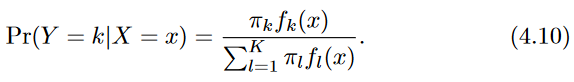
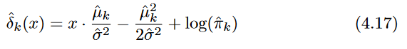
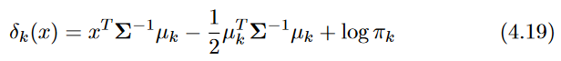
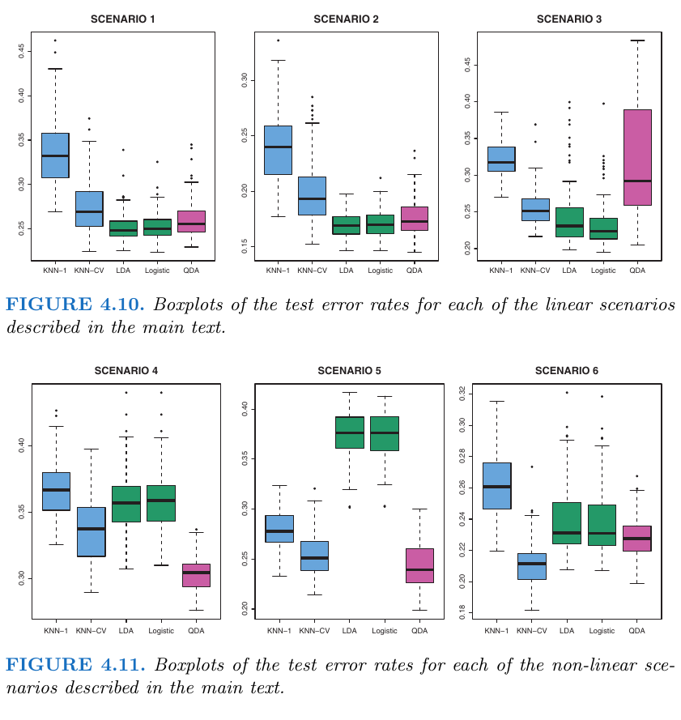

# Definitions

## Bayes' Theorem



## Linear Combination

In mathematics, a linear combination is an expression constructed from a set of terms by multiplying each term by a constant and adding the results (e.g. a linear combination of x and y would be any expression of the form ax + by, where a and b are constants).  The concept of linear combinations is central to linear algebra and related fields of mathematics.

[Source](https://en.wikipedia.org/wiki/Linear_combination)

## Prior Probability

The prior probability of an event is the probability of the event computed before the collection of new data. One begins with a prior probability of an event and revises it in the light of new data. For example, if 0.01 of a population has schizophrenia then the probability that a person drawn at random would have schizophrenia is 0.01. This is the prior probability. If you then learn that that there score on a personality test suggests the person is schizophrenic, you would adjust your probability accordingly. The adjusted probability is the posterior probability. 

[Source](http://onlinestatbook.com/glossary/prior_probability.html)

### Application example:

Bayes' Theorem:  $P(B|E) = \frac{P(E|B) * P(B)}{P(E)}$ 

Variable  Meaning  
--------  -------
P         probability
B         belief
E         evidence
P(B)      probability that B is true (**prior probability**)
P(E)      probability that E is true
P(B|E)    probability of B if E is true
P(E|B)    probability of E if B is true

Suppose that a test for using a particular drug is 99% sensitive and 99% specific. That is, the test will produce 99% true positive results for drug users and 99% true negative results for non-drug users. Suppose that 0.5% of people are users of the drug. What is the probability that a randomly selected individual with a positive test is a drug user?

Variable Example Variable Meaning
-------- ---------------- -------
P(B)     P(User)          0.5% of people are using the drug we are testing for (**prior probability**)
P(E|B)   P(+|User)        The probability of testing positive if you use the drug is 99% 
P(E)     P(+)             The probability of testing positive whether or not you use the drug; includes false positives as well as true positives.

:<math>
\begin{align}
P(\text{User}\mid\text{+}) &= \frac{P(\text{+}\mid\text{User}) P(\text{User})}{P(+)} \\
 &= \frac{P(\text{+}\mid\text{User}) P(\text{User})}{P(\text{+}\mid\text{User}) P(\text{User}) + P(\text{+}\mid\text{Non-user}) P(\text{Non-user})} \\[8pt]
&= \frac{0.99 \times 0.005}{0.99 \times 0.005 + 0.01 \times 0.995} \\[8pt]
&\approx 33.2\%
\end{align}</math>

Even if an individual tests positive, it is more likely that they do not use the drug than that they do. This is because the number of non-users is large compared to the number of users. The number of false positives outweighs the number of true positives. For example, if 1000 individuals are tested, there are expected to be 995 non-users and 5 users. From the 995 non-users, 0.01&nbsp;×&nbsp;995&nbsp;???&nbsp;10 false positives are expected. From the 5 users, 0.99&nbsp;×&nbsp;5&nbsp;???&nbsp;5 true positives are expected. Out of 15 positive results, only 5 are genuine.

The importance of Specificity in this example can be seen by calculating that even if sensitivity is raised to 100% and specificity remains at 99% then the probability of the person being a drug user only rises from 33.2% to 33.4%, but if the sensitivity is held at 99% and the specificity is increased to 99.5% then the probability of the person being a drug user rises to about 49.9%.

[Source](https://en.wikipedia.org/wiki/Bayes%27_theorem)

And another good [reference](https://blogs.scientificamerican.com/cross-check/bayes-s-theorem-what-s-the-big-deal/).

##  Linear Discriminant Analysis for p = 1



Reference:  ISLR Seventh Printing p.138

Process:

* For each observation
  + For each class K
    - Estimate the prior probability that a randomly chosen observation comes from the kth class (i.e. P(B)) ($\pi_k$)
    - Estimate the density function of X for an observation that comes from the kth class (i.e. P(E|B)) ($f_k(x)$)
    - Plug these estimates into the Bayes' Theorem formula for each class K
  + Assign the observation to class K for the Bayes' Theorem formula that gave the largest result (i.e. posterior probability) ($p_k(x)$)
  

The LDA classifier results from assuming that the observations within each class come from a normal distribution with a class-specific mean vector and a common variance $\sigma^2$, and plugging estimates for these parameters into the Bayes classifier.

## Linear Discriminant Analysis for p > 1



We now extend the LDA classifier to the case of multiple predictors. To do this, we will assume that $X = (X_1, X_2,...,X_p)$ is drawn from a multivariate Gaussian (or multivariate normal) distribution, with a class-specific mean vector and a common co-variance matrix. 

The `multivariate Gaussian distribution` assumes that each individual predictor follows a one-dimensional normal distribution, with some correlation between each pair of predictors. 

Once again, we need to estimate the unknown parameters $\mu_1,...,mu_K$, $\pi_1,...,\pi_K$, and $\Sigma$; the formulas are similar to those used in the one dimensional case (see the book for exact details).  The estimates are plugged into the formula, and classifies the observation to the class for which the result of the formula is the largest.

The Bayes classifier works by assigning an observation to the class for which the posterior probability $p_k(X)$ is greatest. In the two-class case, this amounts to assigning an observation to the default class if $Pr(default = Yes|X = x) > 0.5$.  Thus, the Bayes classifier, and by extension LDA, uses a threshold of 50% for the posterior probability of default in order to assign an observation to the default class. However, don't forget we can *modify* this threshold value to better suit our needs and reduce/increase the probabilities that an observation will be assigned to a particular class.

If we change the threshold then the Type I and Type II errors will change as well.  We can graph this relationship by utilizing the `ROC` curve.  The ROC curve is a popular graphic for simultaneously displaying the two types of errors for all possible thresholds.  An ideal ROC curve will hug the top left corner, so the larger area under the ROC curve (the `AUC`) the better the classifier.

## Sensitivity and Specificity

Sensitivity and specificity are statistical measures of the performance of a binary classification test, also known in statistics as a classification function, that are widely used in medicine:

* Sensitivity (also called the true positive rate, the recall, or probability of detection in some fields) measures the proportion of actual positives that are correctly identified as such (e.g., the percentage of sick people who are correctly identified as having the condition). 

* Specificity (also called the true negative rate) measures the proportion of actual negatives that are correctly identified as such (e.g., the percentage of healthy people who are correctly identified as not having the condition).

[Source](https://en.wikipedia.org/wiki/Sensitivity_and_specificity)

## Covariance Matrices

References:

* https://www.theanalysisfactor.com/covariance-matrices/
* https://stattrek.com/matrix-algebra/covariance-matrix.aspx
* https://support.minitab.com/en-us/minitab/18/help-and-how-to/modeling-statistics/anova/supporting-topics/anova-statistics/what-is-the-variance-covariance-matrix/

### Variance

Variance is a measure of the variability or spread in a set of data. Mathematically, it is the average squared deviation from the mean score. We use the following formula to compute variance:

$Var(X) = \sigma^2 = \frac{\Sigma( x - \mu)^2}{N}$

where

* $\sigma$ is the       variance
* $x$ is an individual observation
* $N$ is the total number of observations
* $\mu$ is the mean of the observations


### Covariance

Covariance is a measure of the extent to which corresponding elements from two sets of ordered data move in the same direction. We use the following formula to compute covariance:

$cov(x,y) = \Sigma{ \frac{ (x_i - \bar{x})(y_i - \bar{y})  }{N} }$

where 

* $x_i$ is the i-th individual observation in the first data set
* $\bar{x}$ is the mean of the N scores in the first data set

* $y_i$ is the i-th individual observation in the second data set
* $\bar{y}$ is the mean of the N scores in the second data set

* $N$ is the number of scores in each set of data
* $cov(x,y)$ is the covariance of corresponding scores in the two sets of data

## Quadratic Discriminant Analysis (QDA)

Like LDA, the QDA classifier results from assuming that the observations from each class are drawn from a Gaussian distribution, and plugging estimates for the parameters into Bayes’ theorem in order to perform prediction. However, unlike LDA, QDA assumes that each class has its own covariance matrix.

Why/when would we prefer LDA to QDA, or vice-versa? 

Answer:  The bias-variance trade-off. 

When there are $p$ predictors, then estimating a covariance matrix requires estimating $p(p + 1)/2$ parameters. QDA estimates a separate covariance matrix for each class, for a total of $K_p(p+1)/2$ parameters. With 50 predictors this is some multiple of 1,275, which is a lot of parameters. By instead assuming that the K classes share a common covariance matrix, the LDA model becomes linear in $x$, which means there are $K_p$ linear coefficients to estimate. Consequently, LDA is a much less flexible classifier than QDA, and so has substantially lower variance.  This can potentially lead to improved prediction performance. But there is a trade-off: if LDA’s assumption that the $K$ classes share a common covariance matrix is badly off, then LDA can suffer from high bias. Roughly speaking, LDA tends to be a better bet than QDA if there are relatively few training observations and so reducing variance is crucial. In contrast, QDA is recommended if the training set is very large, so that the variance of the classifier is not a major concern, or if the assumption of a common covariance matrix for the $K$ classes is clearly untenable.

## Comparison of Classification Methods

So far we have considered logistic regression, LDA, and QDA.  We'll also add K-nearest neighbors (KNN) to the mix.  In which scenarios might one method be better than the others?

First, both logistic regression and LDA produce linear decision boundaries. The only difference between the two approaches lies in the fact that Logistic Regression's $\beta_0$ and $\beta_01$ are estimated using maximum likelihood, whereas LDA's $c_0$ and $c_1$ are computed using the estimated mean and variance from a normal distribution. This same connection between LDA and logistic regression also holds for multidimensional data with $p > 1$.

Since LDA assumes that the observations are drawn from a Gaussian distribution with a common covariance matrix in each class, it can provide some improvements over logistic regression when this assumption approximately holds. Conversely, logistic regression can outperform LDA if these Gaussian assumptions are not met.

KNN on the other hand is a completely non-parametric approach:  No assumptions are made about the shape of the decision boundary.  Therefore, we can expect this approach to dominate LDA and logistic regression when the decision boundary is highly non-linear.

On the other hand, KNN does not tell us which predictors are important; we don’t get a table of coefficients as with the other models.

Finally, QDA serves as a compromise between the non-parametric KNN method and the linear LDA and logistic regression approaches. Since QDA assumes a quadratic decision boundary, it can accurately model a wider range of problems than can the linear methods. Though not as flexible as KNN, QDA can perform better in the presence of a limited number of training observations because it does make some assumptions about the form of the decision boundary.

### Applied Comparison Scenarios

From the book:



Scenario 1:  There were 20 training observations in each of two classes.  The observations within each class were uncorrelated 
*Scenario 1:*  There were 20 training observations in each of two classes. The observations within each class were uncorrelated random normal variables with a different mean in each class. The left-hand panel of Figure 4.10 shows that LDA performed well in this setting, as one would expect since this is the model assumed by LDA. KNN performed poorly because it paid a price in terms of variance that was not offset by a reduction in bias. QDA also performed worse than LDA, since it fit a more flexible classifier than necessary. Since logistic regression assumes a linear decision boundary, its results were only slightly inferior to those of LDA.

*Scenario 2:*  Details are as in Scenario 1, except that within each class, the two predictors had a correlation of -0.5. The center panel of Figure 4.10 indicates little change in the relative performances of the methods as compared to the previous scenario.

*Scenario 3:*  We generated $X_1$and $X_2$ from the `t-distribution`, with 50 observations per class. The t-distribution has a similar shape to the normal distribution, but it has a tendency to yield more extreme points—-that is, more points that are far from the mean. In this setting, the decision boundary was still linear, and so fit into the logistic regression framework. The set-up violated the assumptions of LDA, since the observations were not drawn from a normal distribution.  The right-hand panel of Figure 4.10 shows that logistic regression outperformed LDA, though both methods were superior to the other approaches. In particular, the QDA results deteriorated considerably as a consequence of non-normality.

*Scenario 4:*  The data were generated from a normal distribution, with a correlation of 0.5 between the predictors in the first class, and correlation of -0.5 between the predictors in the second class. This setup corresponded to the QDA assumption, and resulted in quadratic decision boundaries. The left-hand panel of Figure 4.11 shows that QDA outperformed all of the other approaches.

*Scenario 5:*  Within each class, the observations were generated from a normal distribution with uncorrelated predictors. However, the responses were sampled from the logistic function using ${X_1}^2$, ${X_2}^2$, and ${X_1} * {X_2}$ as predictors.  Consequently, there is a quadratic decision boundary. The center panel of Figure 4.11 indicates that QDA once again performed best, followed closely by KNN-CV. The linear methods had poor performance.

*Scenario 6:*  Details are as in the previous scenario, but the responses were sampled from a more complicated non-linear function. As a result, even the quadratic decision boundaries of QDA could not adequately model the data. The right-hand panel of Figure 4.11 shows that QDA gave slightly better results than the linear methods, while the much more flexible KNN-CV method gave the best results. But KNN with $K = 1$ gave the worst results out of all methods. This highlights the fact that even when the data exhibits a complex nonlinear relationship, a non-parametric method such as KNN can still give poor results if the level of smoothness is not chosen correctly.

These six examples illustrate that no one method will dominate the others in every situation. When the true decision boundaries are linear, then the LDA and logistic regression approaches will tend to perform well. When the boundaries are moderately non-linear, QDA may give better results. Finally, for much more complicated decision boundaries, a non-parametric approach such as KNN can be superior. But the level of smoothness for a non-parametric approach must be chosen carefully.


# Lab Exercises

## Stock Market Data

```{r}
library(tidyverse)
library(caret)
```


```{r}
library(ISLR)
library(MASS)
attach(Smarket)
```

```{r}
names(Smarket)
```

```{r}
dim(Smarket)
```

```{r}
summary(Smarket)
```

Examine the correlations between the predictors.  Leave out `Direction` since it is a qualitative variable.

```{r}
cor(Smarket[, -9])
```

There doesn't seem to be much correlation in the data, and almost none between the lag variables and `Today`.  The highest correlation value we see is 0.54 between `Volume` and `Year` indicating that volume increases as year increases (which makes sense).  We can observe this visually:

```{r}
plot(Volume, Year)
```

## Logistic Regression

Next, we will fit a logistic regression model in order to predict Direction using Lag1 through Lag5 and Volume. The glm() function fits generalized glm() linear models, a class of models that includes logistic regression. The syntax generalized of the glm() function is similar to that of lm(), except that we must pass in linear model the argument family=binomial in order to tell R to run a logistic regression rather than some other type of generalized linear model.

```{r}
fit = glm(Direction ~ . -Year -Today, data = Smarket, family=binomial)
summary(fit)
```

We note that the coefficient Z-statistic values are small, and the p-values are large (none less than 0.05).  This leads us to accept the null hypothesis and declare that there is no relationship between one or more of the independent variables and the dependent variable.

We can also examine the model's prediction values.  The `type="response"` option tells R to output probabilities of the form $P(Y = 1|X)$, as opposed to other information such as the logit.  If no data set is supplied to the predict() function, then the probabilities are computed for the training data that was used to fit the logistic regression model.

```{r}
probs = predict(fit, type = 'response')
probs[1:10]
```

Since Direction is a qualitative variable we can examine the dummy values R has created for us:

```{r}
contrasts(Direction)
```

Now we know that the values output from the `predict` function are the correspond to the probability of the market going up rather than down.

Next, we can create a confusion matrix:

```{r}
# Create the vector of Direction predictions from the fitted model
preds = rep("Down", dim(Smarket)[1])
preds[probs > 0.5] = 'Up'

# Create the confusion matrix
{
  print(confusionMatrix(factor(preds), factor(Direction))$table)
  print(confusionMatrix(factor(preds), factor(Direction))$overall)
}
```

This appears to tell us that the model is predicting the market's direction correctly 52% of the time, which is a little better than random guessing.  However, we must remember this is the error rate on the `training` data which always has a lower rate than the `test` data.

What would the accuracy look like if we held out some of the training data as a validation set?

```{r}
# Create a boolean list of indices where Year < 2005 as our training data
trainingIndex = (Year < 2005)
tail(Smarket[trainingIndex,])
```

We now fit a logistic regression model using only the subset of the observations that correspond to dates before 2005, using the subset argument.  We then obtain predicted probabilities of the stock market going up for each of the days in our test set-that is, for the days in 2005.

```{r}
# Fit the model using the training data
fit = glm(Direction ~ . -Year -Today, data = Smarket, subset = trainingIndex, family=binomial)

# Make predictions using the validation data
probs = predict(fit, Smarket[!trainingIndex,], type = 'response')
```


```{r}
# Create the vector of Direction predictions from the fitted model
preds = rep("Down", dim(Smarket)[1])
preds[probs > 0.5] = 'Up'

# Create the confusion matrix
{
  print(confusionMatrix(factor(preds), factor(Direction))$table)
  print(confusionMatrix(factor(preds), factor(Direction))$overall)
}
```

We can now see that the validation error rate on data held out from the model fitting is 52% which is _worse_ than random guessing.

## Linear Discriminant Analysis

Two plotting resources:

* https://rstudio-pubs-static.s3.amazonaws.com/35817_2552e05f1d4e4db8ba87b334101a43da.html
* https://www.statmethods.net/advstats/discriminant.html

Now we will perform LDA on the Smarket data. In R, we fit an LDA model using the lda() function, which is part of the MASS library. We fit the model using only the observations before 2005.

```{r}
fit = lda(Direction ~ + Lag1 + Lag2, data = Smarket, subset = trainingIndex)
fit
```

**Prior Probabilities**

The LDA output indicates that $\hat{\pi_1} = 0.492$ and $\hat{\pi_2} = 0.508$; in other words, 49.2% of the training observations correspond to days during which the market went down. 

**Group Means**

The LDA output also provides the group means; these are the average of each predictor within each class, and are used by LDA as estimates of $\mu_k$. These suggest that there is a tendency for the previous 2 days' returns to be negative on days when the market increases, and a tendency for the previous days' returns to be positive on days when the market declines.

**Coefficients of Linear Discriminants**

The coefficients of linear discriminants output provides the linear combination of `Lag1` and `Lag2` that are used to form the LDA decision rule.  In other words, these are the multipliers of the elements of $X = x$ in (4.19).  If $(-0.642 * Lag1) - (0.514 * Lag2)$ is large, then the LDA classifier will predict a market increase, and if it is small, then the LDA classifier will predict a market decline.

The two plots below produces visuals of of the linear discriminants, obtained by computing $(-0.642 * Lag1) - (0.514 * Lag2)$ for each of the training observations.

```{r}
plot(fit, dimen = 1, type = 'both')
```

```{r}
library(klaR)
partimat(Direction ~ + Lag1 + Lag2,data=Smarket, subset = trainingIndex, method="lda") 
```

### LDA Predictions

Create predictions from the fitted LDA model using the `validation data` (i.e. Year == 2005):

```{r}
pred = predict(fit, Smarket[!trainingIndex,])
names(pred)
```

Prediction Name Details
--------------- -------
class           Predictions about the movement of the market from the fitted LDA model.
posterior       A matrix whose _Kth_ column contains the posterior probability that the corresponding observation belongs to the _Kth_ class, computed from (4.10) (i.e. Bayes’ Theorem).  The posterior probability output by the model corresponds to the probability that the market will decrease.
x               _x_ contains the linear discriminants, obtained by computing $(-0.642 * Lag1) - (0.514 * Lag2)$ for each of the training observations.

Confusion matrix:

```{r}
{
  print(confusionMatrix(factor(pred$class), factor(Smarket[!trainingIndex,]$Direction))$table)
  print(confusionMatrix(factor(pred$class), factor(Smarket[!trainingIndex,]$Direction))$overall)
}
```

The posterior probability threshold is 50%, and we can confirm this by comparing the sum of posterior probabilities less than 0.5 to the values in `pred$class`.  Remember, the posterior probability output by the model corresponds to the probability that the market will _decrease_:

```{r}
{
  print(sum(pred$class == "Up"))
  print(sum(pred$posterior[,1] < 0.5))
}
```

## Quadratic Discriminant Analysis (QDA)

Applying QDA to the data is almost exactly the same as applying LDA:

```{r}
fit = qda(Direction ~ + Lag1 + Lag2, data = Smarket, subset = trainingIndex)
fit
```

The output contains the group means. But it does not contain the coefficients of the linear discriminants, because the QDA classifier involves a quadratic, rather than a linear, function of the predictors.

### QDA Predictions

Create predictions from the fitted QDA model using the `validation data` (i.e. Year == 2005):

```{r}
pred = predict(fit, Smarket[!trainingIndex,])
names(pred)
```

Confusion matrix:

```{r}
{
  print(confusionMatrix(factor(pred$class), factor(Smarket[!trainingIndex,]$Direction))$table)
  print(confusionMatrix(factor(pred$class), factor(Smarket[!trainingIndex,]$Direction))$overall)
}
```

The posterior probability threshold is 50%, and we can confirm this by comparing the sum of posterior probabilities less than 0.5 to the values in `pred$class`.  Remember, the posterior probability output by the model corresponds to the probability that the market will _decrease_:

```{r}
{
  print(sum(pred$class == "Up"))
  print(sum(pred$posterior[,1] < 0.5))
}
```

The QDA prediction accurate rate of 60% is 4% more accurate than LDA which had an accuracy rating of 56%.  This implies that the quadratic form assumed by QDA may capture the true relationship more accurately than the linear forms assumed by LDA and logistic regression.  


## K-Nearest Neighbors

```{r}
library(class)
#?knn
```

Setup the argument objects required by the KNN function:

```{r}
train = cbind(Lag1, Lag2)[trainingIndex,] #Smarket[trainingIndex,]
test =  cbind(Lag1, Lag2)[!trainingIndex,] #Smarket[!trainingIndex,]
labels = Smarket[trainingIndex,]$Direction
```

Fit the model with K = 1:

```{r}
set.seed(1)
fit = knn(train, test, labels, k = 1)
attributes(fit)
```

As we can see the `knn` model returns a `factor` with the class assignments of the observations.  We can then create a confusion matrix as we did with the LDA and QDA models:

```{r}
{
  print(confusionMatrix(factor(fit), factor(Smarket[!trainingIndex,]$Direction))$table)
  print(confusionMatrix(factor(fit), factor(Smarket[!trainingIndex,]$Direction))$overall)
}
```

The accuracy is only 50% for `K = 1`.  Increasing `K` to 3:

```{r}
set.seed(1)
fit = knn(train, test, labels, k = 3)
{
  print(confusionMatrix(factor(fit), factor(Smarket[!trainingIndex,]$Direction))$table)
  print(confusionMatrix(factor(fit), factor(Smarket[!trainingIndex,]$Direction))$overall)
}
```

The accuracy has increased by 3%, but is still less than the LDA and QDA models.

### KNN with the Caravan Insurance Data Set

```{r}
#?Caravan
```

```{r}
attach(Caravan)
dim(Caravan)
```

```{r}
head(Caravan)
```

```{r}
summary(Purchase)
```

To account for the differences in scale/units among the predictors we'll scale the data:

```{r}
#?scale

# Center and scale the data; omit the response variable in column 86
data = scale(Caravan[, -86])
```

Create the train and test sets:

```{r}
range = 1:1000

train.x = data[-range,]
test.x = data[range,]

train.y = Caravan$Purchase[-range]
test.y = Caravan$Purchase[range]
```

Create and fit the KNN model:

```{r}
set.seed(1)
fit = knn(train.x, test.x, train.y, k = 1)
```

Compute the accuracy:

```{r}
print(mean(test.y != fit))
```

Is 11.8% a good error rate?  No, because only 6% of the customers purchase, so by trivially guessing 'no' to every observation we could reduce the error rate to 6%!

What if we only cared about how accurate the model was in regard to 'Yes' decisions?

```{r}
print(confusionMatrix(factor(fit), factor(test.y))$table)
```

We would have a `9 / (68 + 9) = 11.7%` correct prediction rate for 'Yes' decisions, which would then make the model better than trivially guessing.

What about `K = 3`?

```{r}
set.seed(1)
fit = knn(train.x, test.x, train.y, k = 3)
print(confusionMatrix(factor(fit), factor(test.y))$table)
```

```{r}
5/(20+5)
```

And `K = 5`?

```{r}
set.seed(1)
fit = knn(train.x, test.x, train.y, k = 5)
print(confusionMatrix(factor(fit), factor(test.y))$table)
```

```{r}
4/(11+4)
```

So the KNN model seems to be doing better and better against the data set as K increases.  Next we'll compare a logistic regression model to the same data for contrast.

## Logistic Regression with the Caravan Insurance Data Set

```{r}
fit = glm(Purchase ~ ., data = Caravan, subset = -range, family = 'binomial')
probs = predict(fit, Caravan[range,], type = 'response')
pred = rep('No', 1000)
pred[probs > .5] = 'Yes'
print(confusionMatrix(factor(pred), factor(Caravan[range,]$Purchase))$table)
```

OK, this looks pretty bad:  We only predict 7 people will purchase, and we are wrong about all 7 predictions.  What if we alter the predicted probability cut-off for the model from its default of 0.5?  We can utilize the `ROCR` library to visualize what the `positive predictive values` would be for a range of cut-off thresholds:

```{r}
library(ROCR)
pr = prediction(probs, Caravan[range,]$Purchase)
perf = performance(pr, "ppv")
{
  plot(perf)
  abline(v = 0.28, col = 'red')
}
```

Let's try again with a 0.28 cut-off threshold value:

```{r}
fit = glm(Purchase ~ ., data = Caravan, subset = -range, family = 'binomial')
probs = predict(fit, Caravan[range,], type = 'response')
pred = rep('No', 1000)
pred[probs > .28] = 'Yes'
print(confusionMatrix(factor(pred), factor(Caravan[range,]$Purchase))$table)
```

```{r}
10/(16+10)
```

The model now outputs predictions that over five times better than randomly guessing.

