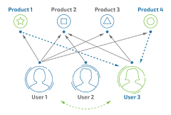

# Table of Contents

* [Table of Contents](#table-of-contents)
* [Intro](#intro)
* [What is a Recommender System?](#what-is-a-recommender-system)
* [Types of Recommender Systems](#types-of-recommender-systems)
  * [Content-based Recommender Systems (CB)](#content-based-recommender-systems-cb)
	 * [How it Works](#how-it-works)
	 * [Potential Drawbacks to Content-based Recommender Systems](#potential-drawbacks-to-content-based-recommender-systems)
  * [Collaborative Filtering Recommender Systems (CF)](#collaborative-filtering-recommender-systems-cf)
	 * [Memory-based CF Example - User-based Collaborative Filtering](#memory-based-cf-example---user-based-collaborative-filtering)
	 * [Model-based CF Example - Item-based Collaborative Filtering](#model-based-cf-example---item-based-collaborative-filtering)
	 * [Potential Drawbacks to Collaborative Filtering](#potential-drawbacks-to-collaborative-filtering)
		* [Data sparsity](#data-sparsity)
		* [Cold Start](#cold-start)
		* [Shilling Attacks](#shilling-attacks)
		* [Scalability](#scalability)
		* [Other Potential Drawbacks](#other-potential-drawbacks)
* [Implementations](#implementations)
   
# Intro

In this next series of write-ups we'll explore recommender systems.  Likely these don't need much introduction, as they are rife throughout today's internet.  If you've ever visited Amazon, Netflix, Pandora, Facebook, etc., etc. then you've come across a recommender system of one sort or another.  

This series on recommender systems is broken down into three parts:

1. The introduction you're reading right now
1. A single implementation of a Content-based recommender system
1. Two implementations of a collaborative filtering recommender system
   1. A user-based recommender (which is memory based)
   1. An item-based recommender (which is model based)

Don't worry for the moment if all the names and types of recommenders are confusing; we'll get to what everything means next.

So with that out of the way let's begin!

# What is a Recommender System?


> Recommender systems apply statistical and knowledge discovery techniques to the problem of making product recommendations based on previously recorded data .... Such recommendations can help to improve the conversion rate by helping the customer to find products she/he wants to buy faster, promote cross-selling by suggesting additional products and can improve customer loyalty through creating a value-added relationship....  ([1](https://cran.r-project.org/web/packages/recommenderlab/vignettes/recommenderlab.pdf))

Or, to put it in a more compact way:

> Recommender systems identify recommendations autonomously for individual users based on past purchases and searches, and on other users' behavior.  ([2](https://www.ibm.com/developerworks/library/os-recommender1/))

Most people will have little troubles understanding what a recommender system is, because they are prevalent throughout today's major internet websites.  For example Amazon, Netflix, Pandora, etc., etc. all use recommender systems to suggest other items you might like based on what you've purchased before, what users similar to you enjoyed, or based on a set of preferences you've given about that you like/don't like.

# Types of Recommender Systems

There are two main categories of recommender systems we'll examine:  
* Content-based (CB)
* Collaborative Filtering (CF)

## Content-based Recommender Systems (CB)

The first recommender system we'll examine is the Content-based recommender system (CB).

### How it Works


> Content-based [recommender system] approaches are based on the idea that if we can elicit the preference structure of a customer (user) concerning product (item) attributes then we can recommend items which rank high for the user’s most desirable attributes. Typically, the preference structure can be elicited by analyzing which items the user prefers.  For example, for movies the Internet Movie Database contains a wide range of attributes to describe movies including genre, director, write, cast, storyline, etc. For music, Pandora, a personalized online radio station, creates a stream of music via content-based recommendations based on a system of hundreds of attributes to describe the essence of music at the fundamental level including rhythm, feel, influences, instruments and many more....  ([2](https://www.ibm.com/developerworks/library/os-recommender1/))

Many times the data for a CB will be shown as a a pair of matrices:  One containing items along with their attributes, and another matrix containing the user ratings of the items.  Here is a simple example to illustrate using movies:

__Item Attribute Matrix__

|Movie  |Drama|Thriller|Action|...|Sci-Fi|
|-------|-----|--------|------|---|------|
|Movie 1|1    |1       |0     |...|0     |
|Movie 2|0    |1       |0     |...|1     |
|Movie 3|0    |0       |1     |...|1     |

A value of "1" in the matrix above means the movie has that associated genre type.  "Movie 1" in this example is a "Drama Thriller," while "Movie 3" is an "Action Sci-Fi" movie.

__User Rating Matrix__

|Movie  |User 1|User 2 |User 3|...|User N|
|-------|------|-------|------|---|------|
|Movie 1|5     |0      |4     |...|0     |
|Movie 2|0     |5      |5     |...|0     |
|Movie 3|3     |0      |0     |...|5     |

So in the matrix above "User 1" gave "Movie 1" a five star rating, but "Movie 3" only a three star rating.

Once we have these two matrices filled out as above we can make predictions about what new movie(s) a given user might enjoy.  We do this by first calculating a set of theta values for the user based on their known movie ratings.  We then multiply the theta values with the rows of the movie attributes matrix.  The result will be a set of numeric values we can utilize to predict what the user might think of a given movie.

Let's try out an example:

Assume we have calculated the theta for some user to be equal to [0 5 0], and that the movie attribute values are [1 1 0].  We then apply the following formula:

```
transpose(User Theta) * Movie Attribute Values = Recommendation Prediction

T([0 5 0]) * [1 1 0] = 5
```

If you do the math for the example user theta and movie attribute values above you'd end up with a result of five, which strongly implies that the user under consideration is going to very much enjoy the movie in question.  As such our system would go ahead and make a positive recommendation for the movie to that particular user.

If we performed the calculations above for all the movies in the dataset, ordered the results by largest prediction values, and then returned the top entries we'd have a nice "Top Recommended Movies" list we could present to the user tailored to their tastes.

### Potential Drawbacks to Content-based Recommender Systems

There are two main potential drawbacks to content-based recommender systems:

>Content based filtering techniques are dependent on items’ metadata. That is, they require rich description of items and very well organized user profile before recommendation can be made to users. This is called limited content analysis. So, the effectiveness of CBF depends on the availability of descriptive data. 
>
>Content overspecialization is another serious problem of CBF technique. Users are restricted to getting recommendations similar to items already defined in their profiles.  ([5](https://www.sciencedirect.com/science/article/pii/S1110866515000341))

## Collaborative Filtering Recommender Systems (CF)



The second recommender system we'll examine is the Collaborative Filtering recommender system (CF).  CF models are usually of one or two types:

* Memory-based CF
* Model-based CF

> Memory-based techniques use the data (likes, votes, clicks, etc) that you have to establish correlations (similarities?) between either users (Collaborative Filtering) or items (Content-Based Recommendation) to recommend an item i to a user u who’s never seen it before. In the case of collaborative filtering, we get the recommendations from items seen by the user’s who are closest to u, hence the term collaborative. In contrast, content-based recommendation tries to compare items using their characteristics (movie genre, actors, book’s publisher or author… etc) to recommend similar new items.

> In a nutshell, memory-based techniques rely heavily on simple similarity measures (Cosine similarity, Pearson correlation, Jaccard coefficient… etc) to match similar people or items together. If we have a huge matrix with users on one dimension and items on the other, with the cells containing votes or likes, then memory-based techniques use similarity measures on two vectors (rows or columns) of such a matrix to generate a number representing similarity.

> Model-based techniques on the other hand try to further fill out this matrix. They tackle the task of “guessing” how much a user will like an item that they did not encounter before. For that they utilize several machine learning algorithms to train on the vector of items for a specific user, then they can build a model that can predict the user’s rating for a new item that has just been added to the system.  ([3](https://yasserebrahim.wordpress.com/2012/10/13/memory-based-vs-model-based-recommendation-systems/))

Doubtless you've already encountered many CF models before online.  For example, you view an item on a webpage, and below the item's description is some portion of text that reads similar to the following:  "Other people who enjoyed this item also liked the following..."  And then below that is a hyperlinked list of _N_ items you can click on to see further details.  The _N_ items in this case were selected by the CF model acting on information it has about users similar to you, items similar to the one you are viewing, or some hybrid combination of both.

Next we'll explore an example of a memory-based CF system and an example of a model-based CF system.  

### Memory-based CF Example - User-based Collaborative Filtering


One of the most prominent memory-based algorithms is user-based collaborative filtering.

> User-based CF ... is a memory-based algorithm which tries to mimics word-of-mouth by analyzing rating data from many individuals. The assumption is that users with similar preferences will rate items similarly. Thus missing ratings for a user can be predicted by first finding a neighborhood of similar users and then aggregate the ratings of these users to form a prediction.

> The neighborhood is defined in terms of similarity between users, either by taking a given number of most similar users (k nearest neighbors) or all users within a given similarity threshold. Popular similarity measures for CF are the Pearson correlation coefficient and the Cosine similarity.  ([1](https://cran.r-project.org/web/packages/recommenderlab/vignettes/recommenderlab.pdf))

Typically in order to build a user-based collaborative filtering system the following would occur:

* Select a particular user (which we'll refer to as U1)
* Use some method to find a neighborhood of people having similar tastes in items to U1
* Choose a subset, K, from the neighborhood of the most similar users (or use them all potentially)
* Aggregate the K-nearest neighbors' items ratings in some fashion
* Return the top N number of items with the highest user-based score that U1 hasn't seen before

### Model-based CF Example - Item-based Collaborative Filtering
TODO

### Potential Drawbacks to Collaborative Filtering

#### Data sparsity
Often the user and item attribute matrices are based on large datasets, but the number of reviews/preferences recorded by the users for the items is sparsely populated.  (We explore this in the [Memory-based Recommendations](../R/RS2-Memory-Based-Recommendations-Jan-2018) write-up.  The data in that write-up shows that for anything after about 50 movies using ratings taper off sharply. Almost 300 different users rated at least one movie, but barely any users at all rated more than 200 movies for example.)  This can be a challenge to the CF algorithm when looking for clusters of similar users.  

> Similarly, new items also have the same problem. When new items are added to system, they need to be rated by substantial number of users before they could be recommended to users who have similar tastes with the ones who rated them. The new item problem does not limit the content-based recommendation, because the recommendation of an item is based on its discrete set of descriptive qualities rather than its ratings. ([4](https://en.wikipedia.org/wiki/Collaborative_filtering#Challenges))

Data sparsity also leads to the cold start problem, which is discussed next.

#### Cold Start


One of the challenges of CF for new users is called "cold start."  A "cold start" is where the CF doesn't have enough--or any at all--ratings/preferences/etc. recorded for a new user to find other, similar users in order to make a quality recommendations of what the new user might like/dislike.  In this case how would the CF algorithm know which items would be good choices to recommend?

One solution might be to randomly suggest various products/items as recommendations, and then begin the refinement process once the new user has provided some number of ratings and preferences that would allow identification of similar users and thus accurate recommendations.

Another possibility would be to user non-item information known about the new user in order to find similar matches.  For example, demographic and/or geographic data points could be leveraged to find similar users, and then from there calculating what the new user might like/dislike.  

#### Shilling Attacks

Shilling attacks are also referred to as "astroturfing," and this refers to the practice of someone giving their items a high number of ratings in an artificial way.  For example, someone could hire a "marketing firm" to create a number of dummy accounts on Amazon, and then have each of those dummy accounts submit a glowing review of some item to push up its ratings and recommendations.  Shilling attacks may also be accompanied by flooding the system with a high number of negative reviews for a competing product in order to lower its recommendation score.

#### Scalability

As the number of users and items grows then the computational requirements of the CF will expand as well.  At a certain point it may become unfeasible to perform the required calculations in the near real-time environment that some applications (websites in particular) may require.     

#### Other Potential Drawbacks

* Synonyms
* Gray sheep
* Diversity and the long tail

You can read more about these other potential CF drawbacks [here](https://en.wikipedia.org/wiki/Collaborative_filtering#Challenges).

# Implementations


So now that we've discussed the various types of recommender systems, what do they look like when implemented?  Well, it just so happens we have some write-ups available to answer that very question in this repository!  ;)

You can find them here:

* [Content Based Recommendations (Dec 2017 - 4,153 words)](../RS1-Content-Based-Recommendations-Dec-2017)
* [Memory Based Recommendations (Jan 2018 - 4,190 words)](../RS2-Memory-Based-Recommendations-Jan-2018)
* [Model-based Recommendations - (Feb 2018 - 3,105 words)](../RS3-Item-Based-Recommendations-Jan-2018)

And finally, thank you for taking the time to read this!
