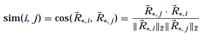

# Table of Contents

* [Table of Contents](#table-of-contents)
* [Introduction](#introduction)
* [Data Review](#data-review)
* [Methodology](#methodology)
  * [Build the model](#build-the-model)
  * [Apply the Model](#apply-the-model)
  * [Output Predictions](#output-predictions)
* [Implementation](#implementation)
  * [Build the Model](#build-the-model-1)
	 * [Model, Rev1](#model-rev1)
	 * [Model, Rev2](#model-rev2)
  * [Apply the Model](#apply-the-model-1)
	 * [Helper Function: applyModel](#helper-function-applymodel)
	 * [Helper Function: showUserRated](#helper-function-showuserrated)
	 * [Output Recommendations](#output-recommendations)
		* [buildModelCS.rev2](#buildmodelcsrev2)
* [Summary](#summary)

# Introduction

In our [last write-up](../RS2-Memory-Based-Recommendations-Jan-2018) we explored building a user-based collaborative filtering system.  We compared a neighborhood of similar users in order to make recommendations for new movies.

In this write-up we'll again explore creating a recommendation system, but this time we'll implement an item-based collaborative filtering system.  

> Item-item collaborative filtering, or item-based, or item-to-item, is a form of collaborative filtering for recommender systems based on the similarity between items calculated using people's ratings of those items.  ([1](https://en.wikipedia.org/wiki/Item-item_collaborative_filtering))

>Item-item models use rating distributions per item, not per user. With more users than items, each item tends to have more ratings than each user, so an item's average rating usually doesn't change quickly. This leads to more stable rating distributions in the model, so the model doesn't have to be rebuilt as often. When users consume and then rate an item, that item's similar items are picked from the existing system model and added to the user's recommendations.  ([1](https://en.wikipedia.org/wiki/Item-item_collaborative_filtering))

I should also point out that there are many implementation of item-based collaborative filtering systems to be found online.  However, after examination many of them don't utilize the same methods, and the methods they do utilize seem a little suspect at times.  So, in order to avoid this ourselves, we'll be building our model directly from the paper _Item-Based Top-N Recommendation
Algorithms_ written by Mukund Deshpande and George Karypis.  You can find a free link to the paper [here](glaros.dtc.umn.edu/gkhome/fetch/papers/itemrsTOIS04.pdf).

And why do we want to use a paper by these idividuals to guide us exactly?  Well:

> Item-item collaborative filtering was invented and used by Amazon.com in 1998.  It was first published in an academic conference in 2001. The authors of that paper, Badrul Sarwar, George Karypis, Joseph Konstan, and John Riedl, won the 2016 Test of Time Award for their paper Item-based collaborative filtering recommendation algorithms. The International World Wide Web Conference committee stated that "this outstanding paper has had a considerable real-world impact".([1](https://en.wikipedia.org/wiki/Item-item_collaborative_filtering))

So, I think that's a good reason.  ;)

We'll also continue to utilize the [MovieLens dataset](https://grouplens.org/datasets/movielens/) for developing the system, and you can also find an annotated, full copy of the R script used in this write-up [here](./fullScript.R).

Let's get started!

# Data Review

Before we begin let's setup our R environment and take a look at the data.

```R
# Clean up our environment
rm(list=ls(all=TRUE))

# Set seed so our results can be reproduced
set.seed(10)

# Load R libraries
library(ggplot2)
library(coop)

# Load the processed MovieLens dataset
# Assumes we have access to and can load the processed data files from a previous write-up:
# (../Machine-Learning/R/RS1-Content-Based-Recommendations-Dec-2017)
setwd("SOME_PATH_ON_YOUR_SYSTEM")
movies = read.csv("./data/movies.csv")
genreMatrix = as.matrix(read.table("./data/genreMatrix.txt", as.is = TRUE))
userMatrix = as.matrix(read.table("./data/userMatrix.txt", as.is = TRUE))
colnames(userMatrix) = seq(1, dim(userMatrix)[2], 1)
```

_Please note that the rest of this section is the same as the work performed in the [last write-up](../R/RS2-Memory-Based-Recommendations-Jan-2018), so if you've already seen that you can skip ahead._


```R
image(userMatrix, col=topo.colors(12), main="Ratings Matrix Density")
```


In the image above areas in dark blue indicate no ratings for a particular movie have been given by a user.  The dataset is clearly sparsely populated which will make it harder on our model to predict accurate recommendations.  You can read more about sparse matrices [here](https://en.wikipedia.org/wiki/Sparse_matrix).

How are the ratings that we do have distributed over the 1-to-5 movie rating scale?

```R
qplot(
	userMatrix[userMatrix > 0], binwidth = .5, 
	main = "Ratings Distribution", xlab = "User Rating", ylab = "Count"
)
summary(userMatrix[userMatrix > 0])

#  Min. 1st Qu.  Median    Mean 3rd Qu.    Max. 
#  0.500   3.000   4.000   3.543   4.000   5.000 
```


The ratings given by the users are skewed to the left, and average out to around 3.5.

Next, how are the mean ratings distributed across the movies?

```R
means = rowMeans(userMatrix, na.rm = TRUE); 
qplot(
  means, binwidth = .3, main = "Movie Rating Mean Distribution", 
  xlab = "Movie Rating Means", ylab = "Number of Movies"
)
```


So almost 2000 movies were rated 3.5 or 4 with much fewer numbers of movies receiving a 1 or 5 rating.

And how active were the users in the dataset about rating movies?

```R
library(matrixStats)
rated = colCounts(userMatrix)
qplot(rated[rated != 0], binwidth = 10, xlab = "Number of Movies Rated", ylab = "Number of Users", main = "Number of Movies Rated by Users")
```


The graph shows that for anything after about 50 movies using ratings taper off.  Almost 300 different users rated at least one movie, but barely any users at all rated more than 200 movies for example.


# Methodology

To build our item-based collaborative filtering system we are going to perform the following steps:

1. Build a model that utilizes similarity between items
2. Apply the model to an active user
3. Output a set of predictions for the active user based on application of the model

## Build the model

Based on the paper _[Item-Based Top-N Recommendation Algorithms](glaros.dtc.umn.edu/gkhome/fetch/papers/itemrsTOIS04.pdf)_ the model should implement the following algorithm:


> The input to this algorithm is the n × m user–item matrix R and a parameter k that specifies the number of item-to-item similarities that will be stored for each item. The output is the model itself, which is represented by an _m × m_ matrix _M_ such that the _jth_ column stores the _k_ most similar items to item _j_.  ([2](glaros.dtc.umn.edu/gkhome/fetch/papers/itemrsTOIS04.pdf))

In order to measure the similarity between the items _i_ and _j_ we'll utilize cosine-based similarity, which is computed via the following formula:



> Formally, if _R_ is the _n × m_ user–item matrix, then the similarity between two items _i_ and _j_ is defined as the cosine of the _n_ dimensional vectors corresponding to the _i_th and _j_th column of matrix _R_.  [2](glaros.dtc.umn.edu/gkhome/fetch/papers/itemrsTOIS04.pdf)

## Apply the Model

Once the model is created we'll apply it via the following algorithm:


> The input to this algorithm is the model _M_, an _m × 1_ vector _U_ that stores the items that have already been purchased by the active user, and the number of items to be recommended (N). The active user’s information in vector _U_ is encoded by setting _Ui_ = 1 if the user has purchased the ith item and zero otherwise. The output of the algorithm is an _m × 1_ vector _x_ whose nonzero entries correspond to the _top-N_ items that were recommended.  ([2](glaros.dtc.umn.edu/gkhome/fetch/papers/itemrsTOIS04.pdf)) 

> The vector _x_ is computed in three steps. First, the vector _x_ is computed by multiplying _M_ with _U_ (line 1). Note that the nonzero entries of _x_ correspond to the union of the _k_ most similar items for each item that has already been purchased by the active user, and that the weight of these entries is nothing more than the sum of these similarities. Second, the entries of _x_ that correspond to items that have already been purchased by the active user are set to zero (loop at line 2). Finally, in the third step, the algorithm sets to zero all the entries of _x_ that have a value smaller than the _N_ largest values of _x_ (loop at line 3).  ([2](glaros.dtc.umn.edu/gkhome/fetch/papers/itemrsTOIS04.pdf))

## Output Predictions

Once we’ve applied the model we'll have a list of index positions that correspond with items in the __movies__ matrix and are in fact the recommendations for the active user.  We can then examine the titles, genres, etc. of the recommended movies with something similar to the following pseudo code:

```R
topRecommendationsMovieIndex = applicationOfModel;
showRecommendedMovies via index lookup ==> movies[topItems, ]
```

# Implementation


First we'll flip the user-item matrix to an _n x m_ format, where _n_ = users and _m_ = items as required by the model:

```R
userMatrix = t(userMatrix)
```

Now we'll write the function to compute cosine-based similarity:
```R
cosineDist = function(vector1, vector2){
  return( sum(vector1 %*% vector2) / sqrt(sum(vector1^2) * sum(vector2^2)) )
}
```
## Build the Model

### Model, Rev1

Next we'll write the function that builds the model.  However, one comment about the model function below first.  You'll notice near the end of the function this statement:

```R
# Scale the similarities to improve top-N recommendation quality
M[,j] = M[,j] / sum(M[,j], na.rm = TRUE)
```

According to _Mukund Deshpande_ and _George Karypis_ normalizing similarities increases the accuracy of the model, because it balances out differences in density between item neighborhoods.  Take for example a set of items that are infrequently purchased.  Overlap between the less-purchased items can skew the model and create higher similarity measures than what should actually be present.  This in turn can result in incorrect recommendations.

To counter this we add the code above to scale the similarities and mitigate the skewing issue as just described.

And with that out of the way we can proceed to the model function:

```R
# Cosine-Based Similarity Model - Rev 1
buildModelCS.rev1 = function(R, k) {
  # Calc the number of items in R
  m = ncol(R)   
  
  # Init matrix to be returned by function
  M = matrix(data = 0, nrow = m, ncol = m)
  
  # Ensure k isn't greater than the number of items in R
  if (m < k) {
    k = m
  }
  
  # Calcuate the cosine-based similiarty for each i and j item pair
  for (j in 1:m) {
    for (i in 1:m) {
      if (i != j) {
        M[i,j] = cosineDist(R[, j], R[, i])    
      } 
    }
  }   # end for (j in 1:m) loop
  
  # Deal with any NaN/NA values in the user-item matrix
  M[is.na(M)] = 0
  
  # Now filter the recommendation list down to the desired k-number of items
  for (j in 1:m) {
  
	# Scale the similarities to improve top-N recommendation quality
    M[,j] = M[,j] / sum(M[,j], na.rm = TRUE)
	
    #if M(i,j) != among the k largest values in M(*,j) then M(i,j) = 0
    kLargestIndex = (sort(M[,j], decreasing = TRUE, index.return = TRUE)$ix)[1:k]
    M[,j][-kLargestIndex] = 0
  } 
  
  # Return the model
  return(M)
}

OK, let's test it out!

```R
# Testing and time to execute measurements
dataSlice = userMatrix[1:300,1:3000]
start_time <- Sys.time()
model = buildModelCS.rev1(dataSlice, 15)
end_time <- Sys.time()

end_time - start_time
Time difference of 2.408088 mins

(sort(model[,1], decreasing = TRUE, index.return = TRUE)$ix)[1:10]
[1] 2507  645  428  233  322  285 1254 1020 1025  101

fix(model)
```

Ouch... 

This model clearly has performance issues and it isn't even using the full data set!  This is due of course to the two for-loops iterating over all the members of the user-item matrix.  (Loops are very slow in R.)  However, on the bright side, we also know exactly how the model is working internally and have a baseline.  So let's see if we can utilize native R functions to speed things up and still obtain the same results.

### Model, Rev2

Let's examine a second implementation of our model which is hopefully much faster:

```R
# Cosine-Based Similarity Model - Rev 2
buildModelCS.rev2 = function(R, k) {
  # Calc the number of items in R
  m = ncol(R)   
  
  # Ensure k isn't greater than the number of items in R
  if (m < k) {
    k = m
  }
  
  # Calculate the consine-based similarity and set the diaganols to zero
  # (i.e. don't let an item recommend itself)
  M = coop::cosine(R)
  diag(M) = 0
  
  # Deal with any NaN/NA values in the user-item matrix
  M[is.na(M)] = 0

  # Now filter the recommendation list down to the desired k-number of items
  for (j in 1:m) {
  
    # Scale the similarities to improve top-N recommendation quality
    M[,j] = M[,j] / sum(M[,j], na.rm = TRUE)

    #if M(i,j) != among the k largest values in M(*,j) then M(i,j) = 0
    kLargestIndex = (sort(M[,j], decreasing = TRUE, index.return = TRUE)$ix)[1:k]
    M[,j][-kLargestIndex] = 0
  }

  # Return the model
  return(M)
}
```

OK, let's test it out!

```R
# Testing and time to execute measurements
dataSlice = userMatrix[1:300,1:3000]
start_time <- Sys.time()
fasterModel = buildModelCS.rev2(dataSlice, 15)
end_time <- Sys.time()

end_time - start_time
Time difference of 3.120671 secs

(sort(fasterModel[,1], decreasing = TRUE, index.return = TRUE)$ix)[1:10]
[1] 2507  645  428  233  322  285 1254 1020 1025  101

fix(fasterModel)
```

Much, much better!  We also achieve the same results as revision one of the model which is a nice sanity check.  With that accomplished we'll move on to applying the model.

## Apply the Model

### Helper Function: applyModel

Let's first write a function to apply the model as per the algorithm we defined in the _Methodology_ section of this write-up.

```R
applyModel = function(M, U, N) {
  # Reminder:  The active user's ratings are stored in vector U.
  # U is encoded by setting Ui = 1 if the user has rated the ith movie and zero otherwise.
  U[U > 0] = 1
  
  # Deal with any NaN/NA values in the model 
  M[is.na(M)] = 0
  
  # Reminder:  Vector x is computed by multiplying M with U.
  # Calculate the union of the k- most similar movies for each movie
  # already rated by the active user.
  x = M %*% U
  
  # Set already rated movies by the active user to zero
  x[which(U != 0)] = 0
  
  # Sets to zero all the entries of x that have a value smaller than the N largest values of x
  x = (sort(x, decreasing = TRUE, index.return = TRUE)$ix)[1:N]

  return(x)
}
```

### Helper Function: showUserRated

Let's also create a helper function to show us which movies a particular user has rated:

```R
showUserRated = function(userMatrix, userIndex, movies) {
  userMatrix = t(userMatrix)
  rated = row.names(userMatrix[(which( userMatrix[, userIndex] != 0 )), ])
  rated = movies[ which (movies$movieId %in% rated), ]
  rated$rating = userMatrix[(which( userMatrix[, userIndex] != 0 )), ][, userIndex]
  rated = rated[with(rated, order(-rating)), ]
  
  return( rated[which(rated$rating >= 3),] )
}
```

### Output Recommendations

Next let's apply the model and make some recommendations!

First we initialize parameters for use in the models:

```R

# Reasonably small values of k, (10 <= k <= 30), lead to good results and higher values 
# lead to either a very small or no improvement. (Mukund Deshpande and George Karypis)
k = 20

alpha = .5
numToRecco = 10
```

We know that the model "buildModelCS.rev1" is __SLOW__, so we're goign to skip it.

#### buildModelCS.rev2

We'll examine the 2nd revision of the cosine similarity model instead (i.e. model "buildModelCS.rev2"):

```R
# Create the model
model.cs.rev2 = buildModelCS.rev2(userMatrix, k)

# Pull and display known ratings for user 1 
showUserRated(userMatrix, 1, movies)
#      movieId                                          title                           genres rating
# 932     1172 Cinema Paradiso (Nuovo cinema Paradiso) (1989)                            Drama    4.0
# 1516    1953                  French Connection, The (1971)            Action|Crime|Thriller    4.0
# 1666    2105                                    Tron (1982)          Action|Adventure|Sci-Fi    4.0
# 1084    1339         Dracula (Bram Stoker's Dracula) (1992)  Fantasy|Horror|Romance|Thriller    3.5
# 834     1029                                   Dumbo (1941) Animation|Children|Drama|Musical    3.0
# 860     1061                                Sleepers (1996)                         Thriller    3.0
# 1709    2150                 Gods Must Be Crazy, The (1980)                 Adventure|Comedy    3.0
# 2926    3671                         Blazing Saddles (1974)                   Comedy|Western    3.0
```

Use the model and help function to make recommendations for user 1:

```R
topItems = applyModel(model.cs.rev2, userMatrix[1,], numToRecco); movies[topItems, ]
#      movieId                                  title                             genres
# 2397    2985                         RoboCop (1987) Action|Crime|Drama|Sci-Fi|Thriller
# 971     1214                           Alien (1979)                      Horror|Sci-Fi
# 1115    1374 Star Trek II: The Wrath of Khan (1982)   Action|Adventure|Sci-Fi|Thriller
# 1021    1266                      Unforgiven (1992)                      Drama|Western
# 2175    2717                 Ghostbusters II (1989)              Comedy|Fantasy|Sci-Fi
# 2116    2641                     Superman II (1980)                      Action|Sci-Fi
# 2186    2728                       Spartacus (1960)           Action|Drama|Romance|War
# 1699    2140               Dark Crystal, The (1982)                  Adventure|Fantasy
# 2779    3479                       Ladyhawke (1985)          Adventure|Fantasy|Romance
# 1698    2139             Secret of NIMH, The (1982) Adventure|Animation|Children|Drama
```

What about for user 14?

```R
showUserRated(userMatrix, 14, movies)
#      movieId                                                     title                                      genres rating
# 2553    3175                                       Galaxy Quest (1999)                     Adventure|Comedy|Sci-Fi      5
# 954     1196     Star Wars: Episode V - The Empire Strikes Back (1980)                     Action|Adventure|Sci-Fi      4
# 2507    3114                                        Toy Story 2 (1999) Adventure|Animation|Children|Comedy|Fantasy      4
# 3001    3751                                        Chicken Run (2000)                   Animation|Children|Comedy      4
# 3193    3988 How the Grinch Stole Christmas (a.k.a. The Grinch) (2000)                     Children|Comedy|Fantasy      4
# 1360    1721                                            Titanic (1997)                               Drama|Romance      3
# 1600    2038                          Cat from Outer Space, The (1978)                      Children|Comedy|Sci-Fi      3
# 1905    2394                               Prince of Egypt, The (1998)                           Animation|Musical      3
# 2104    2628          Star Wars: Episode I - The Phantom Menace (1999)                     Action|Adventure|Sci-Fi      3
# 2174    2716                Ghostbusters (a.k.a. Ghost Busters) (1984)                        Action|Comedy|Sci-Fi      3
# 2182    2724                                      Runaway Bride (1999)                              Comedy|Romance      3
# 2682    3354                                    Mission to Mars (2000)                                      Sci-Fi      3
# 2894    3623                             Mission: Impossible II (2000)                   Action|Adventure|Thriller      3
# 3191    3986                                       6th Day, The (2000)                      Action|Sci-Fi|Thriller      3
```

```R
topItems = applyModel(model.cs.rev2, userMatrix[14,], numToRecco); movies[topItems, ]
#      movieId                                     title                                                    genres
# 1020    1265                      Groundhog Day (1993)                                    Comedy|Fantasy|Romance
# 1254    1580          Men in Black (a.k.a. MIB) (1997)                                      Action|Comedy|Sci-Fi
# 2399    2987           Who Framed Roger Rabbit? (1988) Adventure|Animation|Children|Comedy|Crime|Fantasy|Mystery
# 1025    1270                 Back to the Future (1985)                                   Adventure|Comedy|Sci-Fi
# 2213    2762                   Sixth Sense, The (1999)                                      Drama|Horror|Mystery
# 2242    2797                                Big (1988)                              Comedy|Drama|Fantasy|Romance
# 2063    2571                        Matrix, The (1999)                                    Action|Sci-Fi|Thriller
# 1046    1291 Indiana Jones and the Last Crusade (1989)                                          Action|Adventure
# 2250    2805                   Mickey Blue Eyes (1999)                                            Comedy|Romance
# 889     1097         E.T. the Extra-Terrestrial (1982)                                     Children|Drama|Sci-Fi
```

# Summary

Let's examine the recommendations from this write-up and the last write-up for user 1:

__Last__ write-up's recommendations for user 1:

```R
#      movieId                               title                        genres    score
# 286      319                Shallow Grave (1994)         Comedy|Drama|Thriller 1.838062
# 537      609 Homeward Bound II: Lost in San Fran            Adventure|Children 1.520299
# 628      753         Month by the Lake, A (1995)          Comedy|Drama|Romance 1.461845
# 697      861 Supercop (Police Story 3: Supercop)  Action|Comedy|Crime|Thriller 1.459531
# 937     1177              Enchanted April (1992)                 Drama|Romance 1.446037
# 983     1226               Quiet Man, The (1952)                 Drama|Romance 1.409902
# 991     1235             Harold and Maude (1971)          Comedy|Drama|Romance 1.397736
# 1066    1320     Alien³ (a.k.a. Alien 3) (1992) Action|Horror|Sci-Fi|Thriller 1.360653
# 1724    2168                Dance with Me (1998)                 Drama|Romance 1.360653
# 2946    3691               Private School (1983)                        Comedy 1.348102
```

__This__ write-up's recommendations for user 1:

```R
topItems = applyModel(model.cs.rev2, userMatrix[1,], numToRecco); movies[topItems, ]
#      movieId                                  title                             genres
# 2397    2985                         RoboCop (1987) Action|Crime|Drama|Sci-Fi|Thriller
# 971     1214                           Alien (1979)                      Horror|Sci-Fi
# 1115    1374 Star Trek II: The Wrath of Khan (1982)   Action|Adventure|Sci-Fi|Thriller
# 1021    1266                      Unforgiven (1992)                      Drama|Western
# 2175    2717                 Ghostbusters II (1989)              Comedy|Fantasy|Sci-Fi
# 2116    2641                     Superman II (1980)                      Action|Sci-Fi
# 2186    2728                       Spartacus (1960)           Action|Drama|Romance|War
# 1699    2140               Dark Crystal, The (1982)                  Adventure|Fantasy
# 2779    3479                       Ladyhawke (1985)          Adventure|Fantasy|Romance
# 1698    2139             Secret of NIMH, The (1982) Adventure|Animation|Children|Drama
```

Both recommendation lists seem viable upon inspection, but they are also obviously completely different movie sets.  This of course makes sense as the recommendations came from two very different models:  user-based vs item-based collaborative filtering.  So, which one is better?  Or, would a combination of the recommendations make most sense?

And that, dear reader, will be the subject of our next write-up where analyze and calculate the accuracy of the recommender systems we've covered so far.  :)
