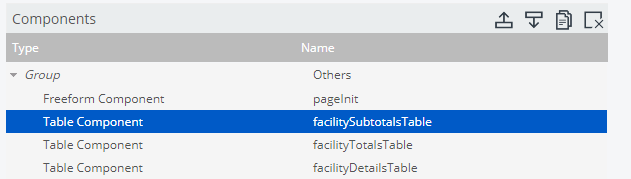
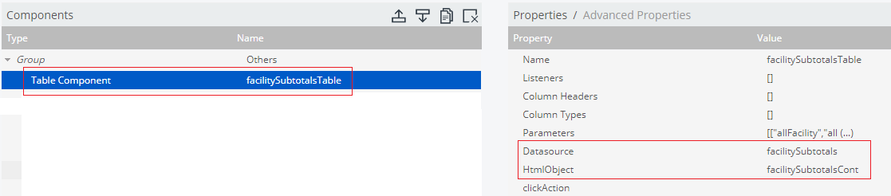

# C-Tools

## Adding a table component summary row

Note:  This write-up assumes a general understanding of how Pentaho's C-Tools works.

I recently needed to add a summary row to a Pentaho C-Tools table component that would:

1. Sum all the values from a particular column in the table
2. Report what percentage of the whole those values made up

I was hoping to have output that looked something like this:


I wasn't able to find a way to do this natively utilizing C-Tools components, so I needed a way to create and append the summary row myself.

### Fetch and store the grand total of all records
In order to accomplish this I first needed to fetch and store the grand total of all records:

1. Create a `sql over sqlJndi` object called 'totalRecordCount' with the following SQL to aggregate the count of all records:
```sql
SELECT COUNT(*) AS TOTAL 
FROM FACT_TABLE
```

2. Assign the output of the SQL into a `simple parameter` component:
* Create the `simple parameter` component


* Create a `query component` to run the total record count query when the page loads and store the results in the `simple parameter` component we created above


### Create and modify the data table
Next, I needed to create the data table and add the summary row in the UI:

1. Create a `table component` call it 'facilitySubtotalsTable'




2. Add data source, parameters, associate the `table component` with the `HtmlObject` that draws the table on the page, etc.




3. Under the table's 'Advanced Properties > Post Execution' area enter the following JavaScript:

```javascript
function f() {
    var totalRecords = Dashboards.getParameterValue("totalRecordCount")[0];
    
    var totals = {};
    totals['records'] = 0;
    totals['percentage'] = 0;
    
    this.rawData.resultset.forEach(function(element) {
        totals['records'] += element[2];
    });
    
    totals['percentage'] = ((totals['records'] / totalRecords) * 100).toFixed(2);
    
    var subtotalSumHtml = 
       '<p class="alert alert-success text-center" style="float: left; width: 100%; font-weight: bold;">' +
       '<i class="fas fa-calculator"></i>&nbsp;&nbsp;' +
       'Subtotal Records Count: ' + Number(totals['records']).toLocaleString() + 
       '&emsp;&emsp;&emsp;&emsp;&emsp;' + 
       '<i class="fas fa-check"></i>&nbsp;&nbsp;' +
        'Subtotal Percentage of Grand Total: ' + totals['percentage'] + '%' +
       '</p>';
    
    $('<div>', {
        id: 'subtotalSumDiv',
        html: subtotalSumHtml,
        css: {}
    }).insertAfter('#facilitySubtotalsContTable'); 
    
}
``` 

4. Once we our work we should have something similar to the screenshot at the beginning of this write-up  :)


### JavaScript breakdown

Let's go over the JavaScript that we placed in the 'Advanced Properties > Post Execution' area of the 'facilitySubtotalsTable' `table component` and see what it's doing:

1. Attach to the results of the query, so that we can aggregate the grand total when the page loaded and store it in a JS variable for use later on:
```javascript
var totalRecords = Dashboards.getParameterValue("totalRecordCount")[0];
```

2. Initialize a JavaScript dictionary to store the results of the column calculations:
```javascript
var totals = {};
totals['records'] = 0;
totals['percentage'] = 0;
```

3. Sum the values of the third column in the dataset and determine what percentage of the grand total the sum is:
```javascript
this.rawData.resultset.forEach(function(element) {
    totals['records'] += element[2];
});
    
totals['percentage'] = ((totals['records'] / totalRecords) * 100).toFixed(2);
```

4. Create the HTML for the last summary row of the table:

```javascript
var subtotalSumHtml = 
   '<p class="alert alert-success text-center" style="float: left; width: 100%; font-weight: bold;">' +
   '<i class="fas fa-calculator"></i>&nbsp;&nbsp;' +
   'Subtotal Records Count: ' + Number(totals['records']).toLocaleString() + 
   '&emsp;&emsp;&emsp;&emsp;&emsp;' + 
   '<i class="fas fa-check"></i>&nbsp;&nbsp;' +
    'Subtotal Percentage of Grand Total: ' + totals['percentage'] + '%' +
   '</p>';
```

5. Append the summary row HTML to the end of the table object:
```javascript
$('<div>', {
    id: 'subtotalSumDiv',
    html: subtotalSumHtml,
    css: {}
}).insertAfter('#facilitySubtotalsContTable');
```
